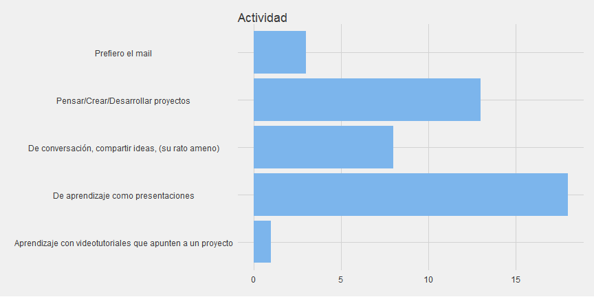
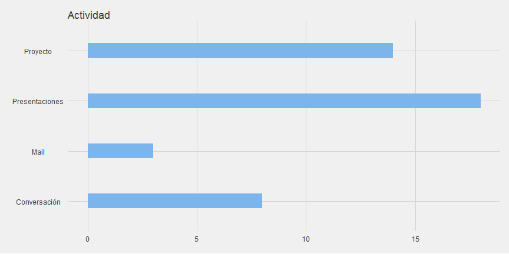
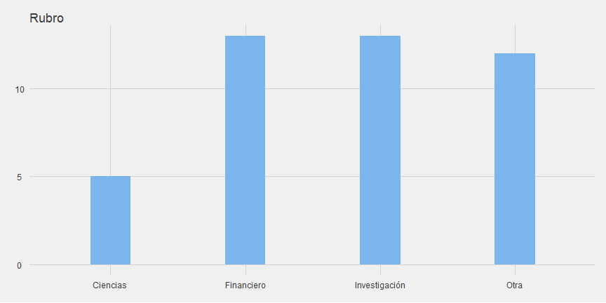
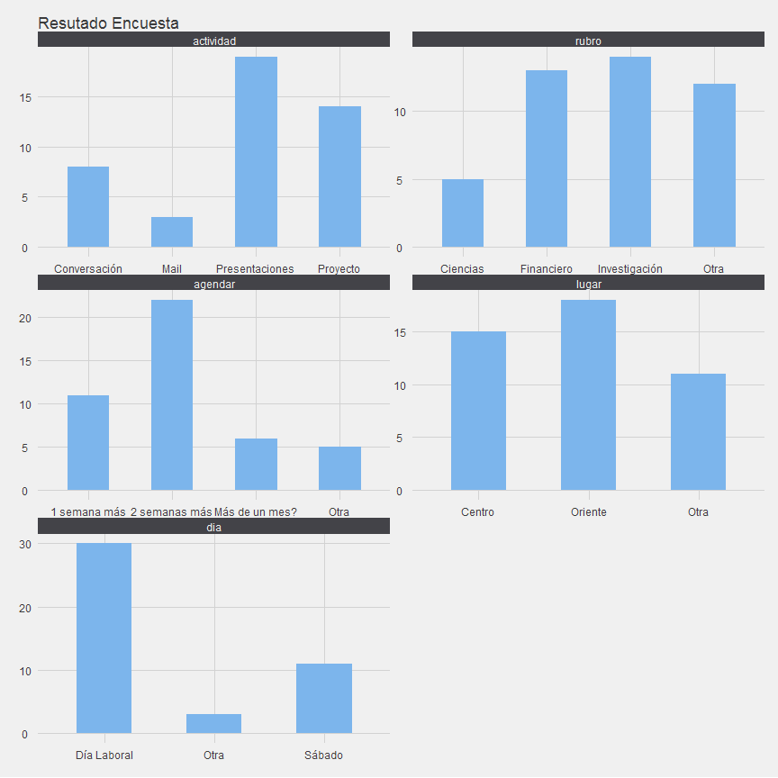
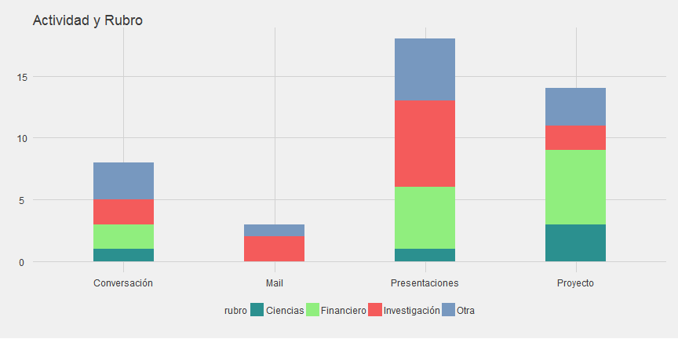
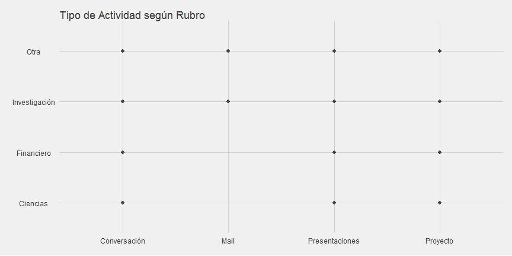
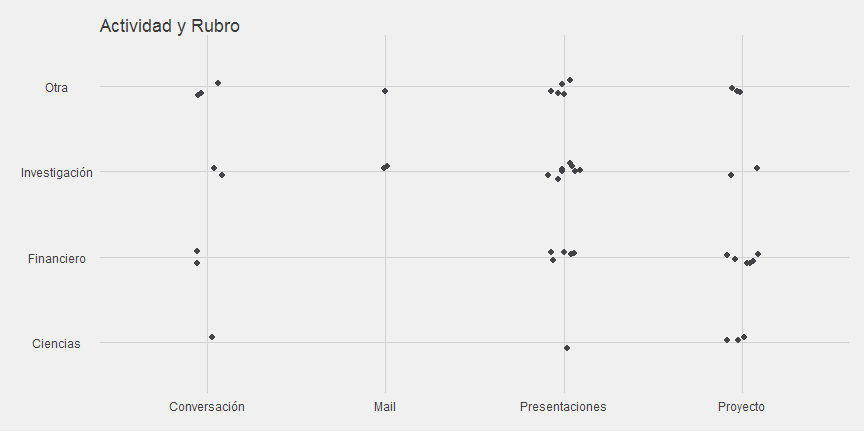
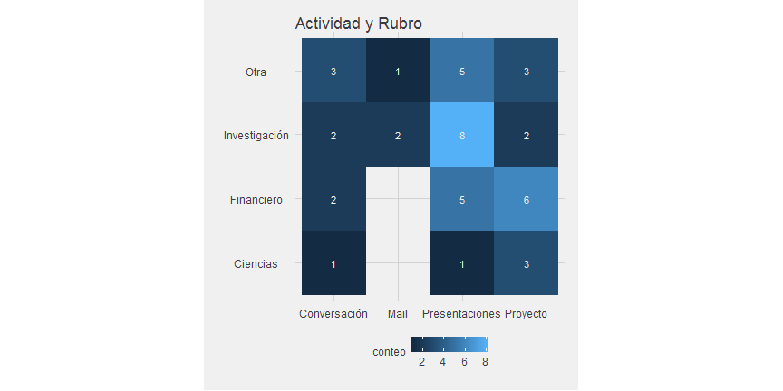
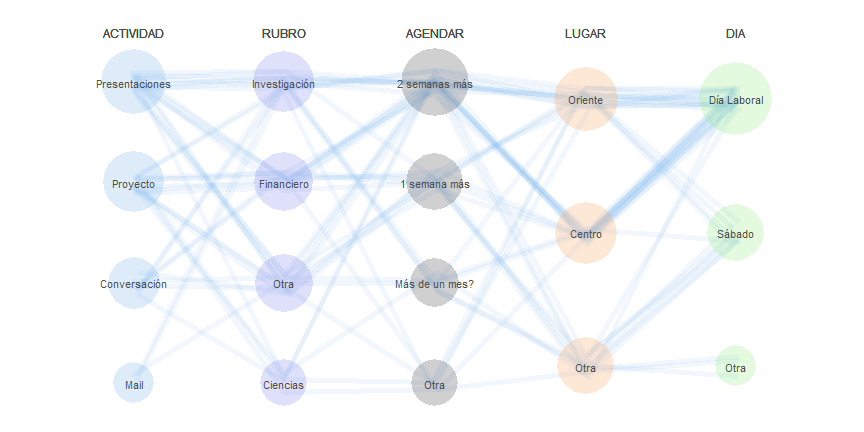

# Que nos dice la encuesta!
Antes de partir:   
- Una buena fuente para ver opciones de ggplot2 están en este este [post](http://zevross.com/blog/2014/08/04/beautiful-plotting-in-r-a-ggplot2-cheatsheet-3/))   
- El script [aca](https://github.com/jbkunst/useRchile/blob/master/20150721-encuesta/readme.R) y link para verlo [aqui](https://rawgit.com/jbkunst/useRchile/master/20150721-encuesta/readme.html).   
- Esta no es la única (y quizás tampoco la mejor) forma de hacerlo, si alguen se anima con probar otro paquete para analizar los datos sería ideal.


Me alegro que harta gente (sí, para mi 30 personas es muucho!) haya 
contestado el formulario.

Los datos los los puedes ver en este [lonk](https://docs.google.com/spreadsheets/d/1WeZA4rnkoHgKvGkeJY0h2ec9__kzkKlF5cW89BR6p6s/pub?gid=675352622&single=true&output=csv).


```r
lonk_largo_que_me_dio_google_para_descargar_el_archivo <- "https://docs.google.com/spreadsheets/d/1WeZA4rnkoHgKvGkeJY0h2ec9__kzkKlF5cW89BR6p6s/pub?gid=675352622&single=true&output=csv"

# esto lo aprendí por http://stackoverflow.com/questions/19890633/r-produces-unsupported-url-scheme-error-when-getting-data-from-https-sites
data <- getURL(lonk_largo_que_me_dio_google_para_descargar_el_archivo, .encoding = "UTF-8", 
               ssl.verifypeer = 0L, followlocation = 1L)

encuesta <- read.csv(text = data)
encuesta <- tbl_df(encuesta)
```

conteo oficial!


```r
message(nrow(encuesta), " encuestados al ", Sys.Date(), Sys.time())
> 43 encuestados al 2015-07-222015-07-22 15:54:23

names(encuesta) <- c("tiempo", "actividad", "rubro", "agendar", "lugar", "dia")

encuesta$id <- seq(nrow(encuesta))
encuesta$tiempo <- NULL

encuesta[1:5,]
```


actividad                                                   rubro                         agendar          lugar                                                                                                 dia            id
----------------------------------------------------------  ----------------------------  ---------------  ----------------------------------------------------------------------------------------------------  ------------  ---
De conversación, compartir ideas, (su rato ameno)           independiente                 Más de un mes?   Santiago Centro                                                                                       Sábado          1
Aprendizaje con videotutoriales que apunten a un proyecto   Ciencias (Bio/Quim/Fis/Mat)   Más de un mes?   Soy de Perú.  Normalmente en casa o Universidad pero  con la laptop para cualquier videoconferencia   Sábado          2
De aprendizaje como presentaciones                          Financiero/Negocios           2 semanas más    Santiago Centro                                                                                       Día Laboral     3
De aprendizaje como presentaciones                          SIG                           1 semana más     Santiago Oriente (Providencia)                                                                        Día Laboral     4
De conversación, compartir ideas, (su rato ameno)           Financiero/Negocios           1 semana más     Las Condes, Santiago                                                                                  Sábado          5

Procederemos a reducir el texto de las respuesta:


```r
head(encuesta$actividad)
> [1] "De conversación, compartir ideas, (su rato ameno)"        
> [2] "Aprendizaje con videotutoriales que apunten a un proyecto"
> [3] "De aprendizaje como presentaciones"                       
> [4] "De aprendizaje como presentaciones"                       
> [5] "De conversación, compartir ideas, (su rato ameno)"        
> [6] "De aprendizaje como presentaciones"

ggplot(encuesta) +
  geom_bar(aes(actividad)) +
  coord_flip() + 
  ggtitle("Actividad")
```



```r
  

opciones <- c("Mail", "Proyecto", "Conversación", "Presentaciones")

for (opcion in opciones){
  # para cada palabra 'opción' la buscamos en la respuesta y si está la reemplazamos ??grepl
  encuesta$actividad <- ifelse(grepl(opcion, encuesta$actividad, ignore.case = TRUE),
                               opcion, encuesta$actividad)
}
```

Veamos que tal que ahora:


```r
ggplot(encuesta) +
  geom_bar(aes(actividad), width = 0.3) + 
  coord_flip() +
  ggtitle("Actividad")
```



```r


opciones <- c("Investigación", "Ciencias", "Financiero")
for (opcion in opciones)  encuesta$rubro <- ifelse(grepl(opcion, encuesta$rubro), opcion, encuesta$rubro)
encuesta$rubro <- ifelse(!encuesta$rubro %in% opciones, "Otra", encuesta$rubro)


opciones <- c("1 semana más", "2 semanas más", "Más de un mes?")
encuesta$agendar <- ifelse(!encuesta$agendar %in% opciones, "Otra", encuesta$agendar)


opciones <- c("Centro", "Oriente", "Otro")
for (opcion in opciones) encuesta$lugar <- ifelse(grepl(opcion, encuesta$lugar), opcion, encuesta$lugar)
encuesta$lugar <- ifelse(!encuesta$lugar %in% opciones, "Otra", encuesta$lugar)


opciones <- c("Día Laboral", "Sábado")
for (opcion in opciones) encuesta$dia <- ifelse(grepl(opcion, encuesta$dia), opcion, encuesta$dia)
encuesta$dia <- ifelse(!encuesta$dia %in% opciones, "Otra", encuesta$dia)
```

Teniendo un poco más limpio los datos, podemos hacer todos los gráficos


```r
ggplot(encuesta) +
  geom_bar(aes(rubro), width = 0.3) +
  scale_y_continuous(labels = function (x) floor(x)) + # evita mostrar decimales en eje Y
  ggtitle("Rubro") 
```



En la pregunta sobre el rubro es la única donde la alternativa **otra** toma relevancia. Esto 
habla sobre lo obvio: hoy en día en cualquier sector hay datos que necesitan analizar.
   
Podemos hacer algo más entretenido para graficar todo, esto es un poco rebuscado pero sirve y 
no son muchas líneas de código. 


```r
encuesta2 <- encuesta %>%
  gather(pregunta, respuesta, -id)
```

Comparar esto


```r
encuesta %>% filter(id == 1)
```


actividad      rubro   agendar          lugar    dia       id
-------------  ------  ---------------  -------  -------  ---
Conversación   Otra    Más de un mes?   Centro   Sábado     1

Con esto


```r
encuesta2 %>% filter(id == 1)
```


 id  pregunta    respuesta      
---  ----------  ---------------
  1  actividad   Conversación   
  1  rubro       Otra           
  1  agendar     Más de un mes? 
  1  lugar       Centro         
  1  dia         Sábado         

```r
ggplot(encuesta2) +
  geom_bar(aes(respuesta), width = 0.5) + 
  facet_wrap(~pregunta, scales = "free", nrow = 3)  +
  scale_y_continuous(labels = function(x) floor(x)) + 
  ggtitle("Resutado Encuesta")
```



gráficos con más de una variable?


```r
ggplot(encuesta) +
  geom_bar(aes(actividad, fill = rubro), width = 0.4) +
  scale_fill_hc(palette = "darkunica") + 
  ggtitle("Actividad y Rubro")
```



O mejor!:


```r
ggplot(encuesta) +
  geom_point(aes(actividad, rubro)) +
  ggtitle("Tipo de Actividad según Rubro")
```



?! :P
Esto lo aprendí hace poco, el **[jitter](http://docs.ggplot2.org/0.9.3/position_jitter.html)**.


```r
ggplot(encuesta) +
  geom_point(aes(actividad, rubro),
             position = position_jitter(width = 0.1, height = 0.1)) +
  ggtitle("Actividad y Rubro")
```



Otra alternativa:


```r
encuesta3 <- encuesta %>% 
  group_by(actividad, rubro) %>% 
  summarize(conteo = n())

head(encuesta3)
```


actividad      rubro            conteo
-------------  --------------  -------
Conversación   Ciencias              1
Conversación   Financiero            2
Conversación   Investigación         2
Conversación   Otra                  3
Mail           Investigación         2
Mail           Otra                  1

```r

ggplot(encuesta3, aes(actividad, rubro)) +
  geom_tile(aes(fill = conteo)) + 
  geom_text(aes(label = conteo), color = "#F0F0F0") + 
  coord_equal() +
  ggtitle("Actividad y Rubro")
```



> Los de rubro **Investigación** tienden a preferir las **presentaciones**,
> a los del área **Financiera** los **proyectos**.
    
Finalmente mostrar que con ggplot2 puedes eventualmente hacer lo que quieras si te das el tiempo
de hacerlo ;)
Eso es una suerte de *parallel set*, cada linea es uno de nosotros. El tamaño de cada círculo
es proporcional al tamaño de la gente que repondió dicha alternativa.


```r
encuesta_pos <- plyr::ldply(names(encuesta)[-ncol(encuesta)], function(col){
  respuesta <- unique(encuesta[[col]])
  df_aux <- data_frame(respuesta,
                       pregunta = col,
                       respuesta_value = (seq(length(respuesta)) - 0.5)/length(respuesta),
                       pregunta_value = which(names(encuesta) == col))
  df_aux
}) %>% tbl_df()

encuesta_pos <- encuesta_pos %>% 
  left_join(encuesta2 %>% 
              group_by(pregunta, respuesta) %>% 
              summarize(conteo = n()),
            by = c("pregunta", "respuesta"))

head(encuesta_pos)
```


respuesta        pregunta     respuesta_value   pregunta_value   conteo
---------------  ----------  ----------------  ---------------  -------
Conversación     actividad              0.125                1        8
Proyecto         actividad              0.375                1       14
Presentaciones   actividad              0.625                1       18
Mail             actividad              0.875                1        3
Otra             rubro                  0.125                2       12
Ciencias         rubro                  0.375                2        5

```r

encuestaxp <- encuesta2 %>% left_join(encuesta_pos, by =  c("pregunta", "respuesta")) 

set.seed(100)
d <- 0.5

ggplot(encuestaxp) + 
  geom_line(aes(pregunta_value, respuesta_value, group = id, color = id),
            alpha = 0.1, size = 2, color = "#7cb5ec",
            position = position_jitter(width = 0.03, height = 0.03)) +
  geom_point(data = encuesta_pos,
             aes(pregunta_value, respuesta_value, size = sqrt(conteo), color = pregunta),
             alpha = 0.25) +
  scale_size_area(max_size = 35) +
  scale_color_hc() + 
  geom_text(data = encuesta_pos, aes(pregunta_value, respuesta_value, label = respuesta)) +
  geom_text(data = encuesta_pos, aes(pregunta_value, 1, label = toupper(pregunta)), size = 4.2) +
  theme_map() + theme(legend.position = "none") +
  xlim((1 - d),(5 + d))
```




---
title: "readme.R"
author: "jkunst"
date: "Wed Jul 22 15:54:15 2015"
---
