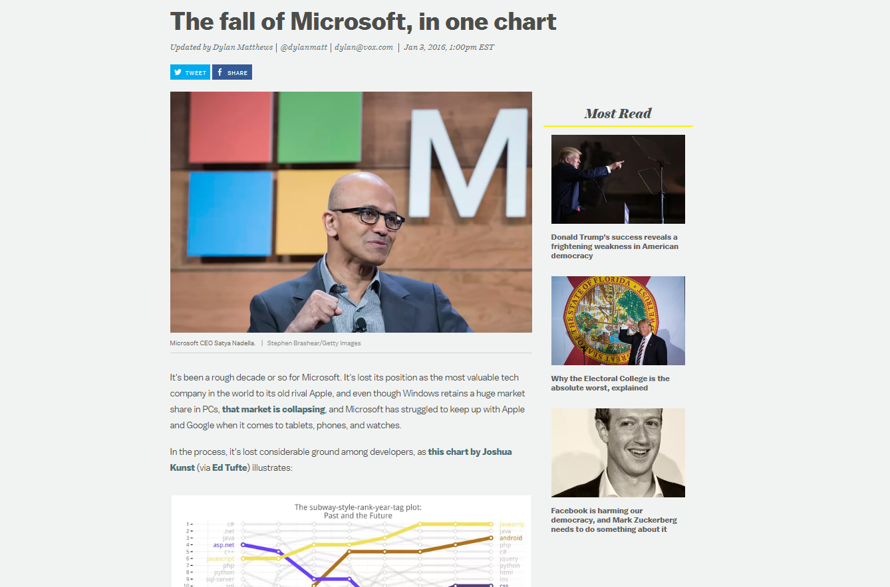

# Quien creo ser {.section-title-white .center data-background="http://cliparts.co/cliparts/8cE/bkB/8cEbkByXi.jpg"}

## De dia, alguien normal {data-background="http://i.giphy.com/l2JHVUriDGEtWOx0c.gif"}

## De noche, hacker {data-background=#000 data-background-iframe="http://giphy.com/embed/YQitE4YNQNahy"}

## Nah

- Estadístico Y un mix de cosas debido a la experiencia
- Evangelizador de **R** Oh sí!
- Esporádicamente blogero Cuando el tiempo da
- Me gusta escribir `código` Sep
- Analizar y visualizar datos Cuado la imaginación da
- Compartir todo lo anterior En forma de paquetes y posts

# Que vengo a contar {.center}

## De mi workflow de <strike>trabajo</strike> vida y del día a día

## Recomendaciones subjetivas y no tan tan subjetivas

## Algunos post que he escrito en mi camino para pavimentar el vuestro

# ¿Qué preguntamos en Stack Overflow? {.center data-background="http://tableless.com.br/wp-content/uploads/2014/01/stackoverflow-portugues.jpg"}

## Contexto

> - StackOverflow (SO) es el sitio de Q&A más grande
del universo
> - Preguntas de código, lenguajes, etc. 
> - Mucha información

## ¿Por qué? 

> - Por gusto, quería aprender a usar `dplyr` vía una base de datos `sqlite`
> - Era una base grande. Un xml de 27gb 
> - Saber que es lo que más se pregunta ahora (y también antes)
> - Conocer estructura de subtemas

## Pasos Claves

> - Importar todo ese gran `xml` a bbdd. Escribir un parser
> - Resumir millones de preguntas a información de tags
> - Conteos de tags por años
> - Conteos de preguntas por combinaciones de tags (2)

## Ranking por año

## Relación tags/tags

## {data-background-iframe="http://jkunst.com/htmlwidgets/tagoverflow.html"}

## Relación tags/tags vs2 

 { width: 200px; }

## Moralejas

## Moralejas

> - Saber que conclusiones se pueden obtener de tus datos/viz
> - Siempre existen alternativas para visualizar mejor lo que se desea

# Pokemon A visualizarlos todos {.center data-background="img/pkmnwall.jpg"}

## Contexto

> - Hace tiempo se venía pkmn go
> - Los vi cuando pequeños cuando eran 10, ahora son como mil
> - Quería hacer un post con la librería `highcharter`

## Pasos Claves

> - Importar desde distintas fuentes datos, de estadísticas, colores, etc.
> - Partir de conteos a algo cada vez más complejo
> - Buscar una metodología para visualizar mucha información (observaciones y variables)

## Partiendo contándolos

##  {data-background-iframe="http://jkunst.com/htmlwidgets/pokemon-visualize-em-all/highchart_kiljgow.html"}

## Agregando otra dimensión

## {data-background-iframe="http://jkunst.com/htmlwidgets/pokemon-visualize-em-all/highchart_ihludtn.html"}

## Visualizándolos todos

## {data-background-iframe="http://jkunst.com/htmlwidgets/pokemon-visualize-em-all/highchart_pnjkfev.html"}

## Moralejas

> - Siempre se aprende algo nuevo. Apliqué un algoritmo TSNE que nunca antes había utlizando
> - Siempre todo se puede mejorar (ver 2do viz)

# {data-background="http://hivewallpaper.com/wallpaper/2015/02/this-is-the-end-28-cool-wallpaper.jpg"} 

## Comentarios Finales

- PRogramen por que sí y también por que no.
- Usen R (si quieren)
- Si hacen las cosas por gusto, mucho más *mejors*
- Espero les sirva un poco esta presentación ;) Gracias!

