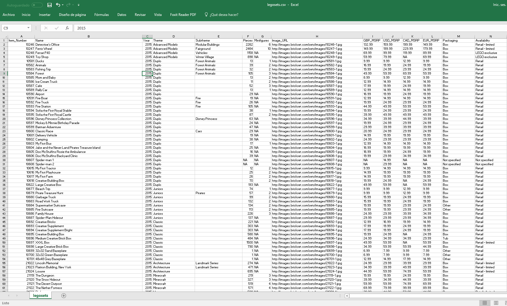
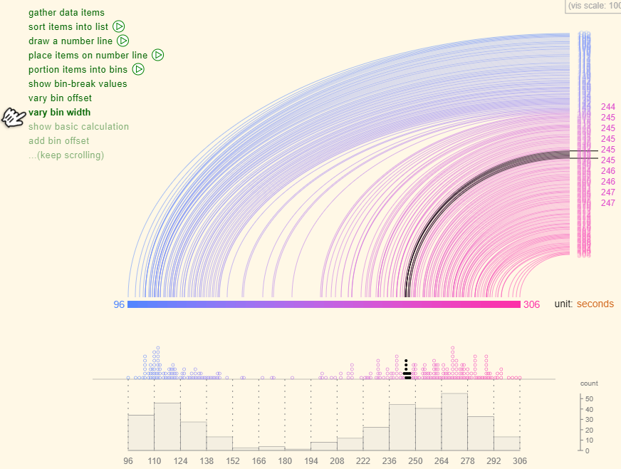

# { data-background="img/data-culture.jpg"}

```{r, include = FALSE}
source("R/setup.R")
```

## Que haremos?

> - Introducción
> - Análsis Exploratorio de Datos (AED)
> - Estadística Descriptiva (ED)
>      * Medidas de Tendencia
>      * Visualización de datos
> - Estudiar Ejemplos
<span class="fragment">, hacer ejemplos</span><span class="fragment">, __equivocarnos__</span><span class="fragment">, __corregirnos__</span><span class="fragment">, vivir ejemplos</span>

# Introducción { .center .white data-background="#F44336"}

## Introducción

```{r, out.height= "350px", echo=FALSE}
knitr::include_graphics("https://visualizacion-uc.github.io/procesamiento-y-analisis-de-datos/clases/img/tidy-data.png")
```

Fuente: R for Data Science, Wickham & Grolemund

## Introducción

Antes de __explicar__ debemos __entender__

<span class="fragment">
El Análisis __Exploratorio__ y la 
Estadística __Descriptiva__ son parte clave 
para el entendimiento</span>

<span class="fragment">
AED y ED van de la mano. AED es el fin y ED una herramienta para 
lograrlo
</span>

<span class="fragment">`r ico("quote-left")` Escuchar lo que los datos nos hablan</span>


## Glosario

> - Una __variable__ es una cantidad, que puede ser medida: estatura, magnitud
de un sismo, velocidad de un huracán, inteligencia (__¿?__)
> - Un __valor__ es un estado de la variable cuando se mide: 1.20 metros, 8° Richter
> - Una __observación__ o __caso__  es un conjunto de mediciones -no de la misma
variable necesariamente- pero si en un mismo instante y a un mismo objeto.

## Glosario

> - __Datos tabulados__ es un conjunto de _valores_ cada uno asociado
a una _variable_ y una _observación_


## Prerequisitos

Antes de partir necesitamos:

- Entusiasmo
- Mantener la mente abierta
- Familiarizado con `ggplot2` y `dplyr`

# Análisis Exploratorio de Datos { .center .white data-background="#3F51B5"}

## Análisis Exploratorio de Datos 

No existe definición formal con reglas a seguir. Es un __estado mental__

- Generar preguntas acerca de los datos
- Buscar respuestas visualizando, transformando los datos
- Hacer nuevas preguntas a partir de lo aprendido

<span class="fragment">__Generar conocimiento__</span>

----

Generar conocimiento no solo implica extraer la información que tratan de medir
los datos

<span class="fragment">Este conocimiento puede estar también en conocer si los datos fueron bien medidos o existen algunos registros datos mal registrados</span>

<span class="fragment">__Validar calidad de los datos__</span>

## Visualizando Distribuciones { .right .white data-background-iframe="vis-dis.html" }

## Distribución

Distribución se relaciona a la forma que varían los datos de medición en 
medición

<span class="fragment">Estudiando la forma de como se distribuyen los datos podemos ver
cuales son los más comunes, o ver si exsiten casos raros<span>

<span class="fragment">Y variará principalmente del tipo de variable analizada:
__categórica__ o __continua__</span>

## Dataset Legos { .left .white    data-background="http://media-cdn.timesfreepress.com/img/photos/2016/07/25/1469464845_0727MfeatLibrary1-C_t1070_h5be62d5b4b340aded4d6baf5bd671ee4fd6571f4.jpg" }

----

```{r}
# cargar paquete con funciones que nos ayudarán
library(tidyverse)

# leo datos desde una url
legos <- read_csv("https://raw.githubusercontent.com/seankross/lego/master/data-tidy/legosets.csv")

# primer paso! paso #1
glimpse(legos)
```

----

¿Cuántos temas hay?

```{r}
legos %>% count(Theme, sort = TRUE)
```

----

¿Cuántos temas hay?

```{r}
ggplot(legos) +
  geom_bar(aes(Theme))
```

----

¿Cuántos temas hay?
 


<span class="fragment">Muy __seguro__ nos encontraremos con cosas
de este estilo donde tenemos que modificar nuestros
resultados</span>

----

¿Cuántos temas hay?

```{r}
library(forcats)

# creamos variable derivada que agrupe grupe las otras
# categorías que no corresponden a los 7 más grandes 
# fct_lump
legos <- mutate(legos, Theme2 = fct_lump(Theme, n = 7))
ggplot(legos) + geom_bar(aes(Theme2))
```

----

¿Cuáles son los tipos de envoltorio?

```{r}
legos %>% count(Packaging, sort = TRUE)
```

----

¿Cuáles son los tipos de envoltorio?

```{r}
ggplot(legos) +
  geom_bar(aes(Packaging))
```

----

¿Y esas etiquetas? 


----

¿Y esas etiquetas? 

```{r}
ggplot(legos) +
  geom_bar(aes(Packaging)) +
  coord_flip() # rotar :D
```

----

¿Y esas etiquetas? 

```{r}
legos <- mutate(legos, Packaging = fct_infreq(Packaging)) # ordenar
ggplot(legos) +
  geom_bar(aes(Packaging)) + coord_flip() # rotar :D
```

----

¿Desde cuándo se _tenemos registros_ de sets de legos?*

```{r}
ggplot(legos) +
  geom_bar(aes(Year))
```

----

¿Cuántas piezas traen los sets?

```{r}
ggplot(legos) +
  geom_histogram(aes(Pieces))
```

----

¿Cuántas piezas traen los sets?

```{r}
legos <- mutate(legos, Pieces2 = ifelse(Pieces > 1000, 1000, Pieces))
ggplot(legos) + geom_histogram(aes(Pieces2))
```


----

¿Cuántas minifuguras traen los sets?

```{r}
ggplot(legos) +
  geom_histogram(aes(Minifigures))
```

----

¿Cuántos sets traen más de 25 figuras? ¿Cuáles son?

```{r}
legos %>% 
  filter(Minifigures > 25) %>% 
  select(Name, Year, Theme, Minifigures)
```

## Al infinito y más allá


# Estadística Descriptiva { .center .white data-background="#4CAF50"}

## Estadística Descriptiva

Conjunto de procedimientos para __resumir__ datos

- Medidas de tendencia central y dispersión<span class="fragment">. No solo basta con ver que valores puede tomar una variable<span>
- Visualización de datos<span class="fragment">. Distintos gráficos nos cuentan diferente información acerca de la variable(s)<span>

<span class="fragment">__Sintetizar información__<span>

## Motivación

>- Te mandan un _inocente_ archivo
>- Te pieden que describas el contenido 
>- Y obtengas información relevante
>- Claramente nunca habías visto este tipo de información

----

Lo abres y 

<span class="fragment">

<span>

## Glosario

Tipos de Variables

> - Categórica
>      * Nominal. Especie: perro, gato
>      * Ordinal. Satistacción bueno, malo, ...
> - Cuantitativa
>      * Discreta. # hijos: 0, 1, 2, ...
>      * Continua. Peso; 3.54, 5.45

## Medidas de Tendencia y Dispersión

Son indicadores (generalmente un número) obtenidos de los datos 
que __resumen__ información y nos hablan de alguna característica de 
la __distribución__ de la variable

<span class="fragment">Nos ayudan a tener una idea más fina en __donde se concentran__
las variables y que __tan concentrados__ están los valores</span>

## Medidas de Tendencia Central

Nos señalan el valor en _torno al cual se concentran los datos_

>- __Media__ o __Promedio__: La suma de los datos dividido por la cantidad de los mismos
>- Mediana: Es el valor que está al medio cuando los datos se ordenan
>- Moda: Es el valor que más se repite. Este se usa cuando la variable es _discreta_

## Medidas de Dispersión

Son valores que nos describen la dispersión de los datos. Es decir, __que tan concentrados__ están:

>- __Desviación estándar__: Mide el grado de dispersión en torno a la media
>- Rango: Es el tamaño del intervalo que cubren los datos, el mayor valor menos el mínimo

## Ejemplo equipos

## DataSaurus { .white .right data-background="img/datasaurus.jpg"}

----

```{r}
library(datasauRus) # install.packages("datasauRus")

# exploramos
datasaurus_dozen
```

----

```{r}
# contamos categorías de la variable `dataset`
datasaurus_dozen %>% 
  count(dataset)

# creamos dos sub data frames
d1 <- datasaurus_dozen %>% filter(dataset == "away")
d2 <- datasaurus_dozen %>% filter(dataset == "dino")
```

----

Exploramos la primera

```{r}
glimpse(d1)

d1 %>% 
  summarise(
    x_mean = mean(x),
    y_mean = mean(y),
    x_sd = sd(x),
    y_sd = sd(y),
    xy_corr = cor(x, y)
  )
```

----

Luego la segunda

```{r}
glimpse(d2)

d2 %>% 
  summarise(
    x_mean = mean(x),
    y_mean = mean(y),
    x_sd = sd(x),
    y_sd = sd(y),
    xy_corr = cor(x, y)
  )
```

---- 

Resultados muy similares ¿Asumimos que los datos distribuyen igual?

```{r, eval=FALSE}
ggplot(d1) + geom_point(aes(x, y))
ggplot(d2) + geom_point(aes(x, y))
```
```{r, echo=FALSE}
grid.arrange(
  ggplot(d1) + geom_point(aes(x, y), size = 1, color = "gray50") + theme(aspect.ratio=1),
  ggplot(d2) + geom_point(aes(x, y), size = 1, color = "gray50") + theme(aspect.ratio=1),
  nrow = 1
)
```

----
```{r}
datasaurus_dozen %>% 
  group_by(dataset) %>% 
  summarise(
    x_mean = mean(x),
    y_mean = mean(y),
    x_sd = sd(x),
    y_sd = sd(y),
    xy_corr = cor(x, y)
  )
```

----

```{r, fig.height=5}
ggplot(filter(datasaurus_dozen, dataset != "circle")) +
  geom_point(aes(x, y, color = dataset), size = 0.6) + 
  facet_wrap(~ dataset) + # hacer mini multiples segun la variable dataset
  theme(legend.position = "none")
```

----

Si te dicen que en una película a la mitad se pone entretenida, existen
__muchas__ películas que que cumplen dicha característica y no necesariamente
habla de la que tu conoces que a la mitad se vuelve entretenida 


## Visualización de datos { .left data-background="http://www.wordstream.com/images/data-visualization-tools-concept.png"}

## Visualización de datos

Se refiere a la representación gráfica de los datos __codificando la información__ como: posición, tamaño, formas, colores


----

```{r, echo=FALSE, fig.width=8, fig.height=6}
ggplot(legos) + 
  geom_point(aes(Pieces, USD_MSRP, size = Minifigures, color = Year), alpha = 0.7) +
  scale_color_viridis(option = "A") + 
  scale_y_sqrt(name = "Precio USD", labels = dollar, limits = c(0, 300)) +
  scale_x_sqrt(name = "Piezas", labels = comma, limits = c(0, 2000)) 
```

----

```{r, echo=FALSE, fig.width=8, fig.height=6}
data(gapminder, package = "gapminder")

gapminder %>% 
  group_by(country) %>% 
  filter(row_number() == n()) %>% 
  ungroup() %>% 
  ggplot() + 
  geom_point(aes(lifeExp, gdpPercap, size = pop, color = continent), alpha = 0.7) +
  scale_color_viridis(option = "D", discrete = TRUE) + 
  scale_y_sqrt(name = "GDP per Capita", labels = comma, limits = c(NA, NA)) +
  scale_x_continuous(name = "Esperanza de vida", labels = comma, limits = c(NA, NA)) +
  scale_size(labels = comma, range = c(3, 10), breaks = c(100, 1000, 2000)*1e6)
```

----

```{r, echo=FALSE, fig.width=8, fig.height=6}
# install.packages(c("rgexf", "ggnetwork", "intergraph"))
# 316
library(igraph)
library(rgexf)
library(stringr)
library(ggnetwork)
library(ggrepel)

net <- "http://media.moviegalaxies.com/gexf/92.gexf" %>% 
  read_lines() %>% 
  read.gexf() %>% 
  gexf.to.igraph()

V(net)$name <- str_to_title(V(net)$name)
V(net)$label <- V(net)$name %>% 
  str_extract_all("^\\w{2}| \\w") %>% 
  map_chr(function(x) {
    x %>% unlist() %>% str_c(collapse = "")
  })
V(net)$size <- page.rank(net)$vector
cl <- cluster_fast_greedy(net)
V(net)$comm <- membership(cl)
V(net)$color <- colorize(V(net)$comm)

# head(ggnetwork(net))
set.seed(123)
ggnet <- ggnetwork(net)
dfnet2 <- ggnet %>%
  as.matrix() %>%
  as.data.frame() %>%
  tbl_df() %>%
  select(x, y, vertex.names, weight, size) %>%
  mutate_all(as.character) %>%
  mutate_at(vars(x, y, weight, size), as.numeric) %>%
  filter(is.na(weight))

ggplot(ggnet) + 
  geom_edges(aes(x, y, size = width, color = factor(comm),
           xend = xend, yend = yend), color = "gray", size = 1) +
  geom_point(aes(x, y, size = size, color = factor(comm))) +
  geom_text_repel(aes(x, y, label = vertex.names, size = size),
                  data = dfnet2, color = "#666666",
                  family = "Roboto Condensed") +
  scale_color_viridis(discrete = TRUE) + 
  theme_blank() +
  labs(size = "Pagerank", color = "Comunidad")
```

----

Existen muchos tipos de gráficos, y su uso dependerá:

>- Tipo de variable
>- Información que quiero extraer 

<span class="fragment">No todos los gráficos tiene ek mismo __objetivo__. Ni
tampoco comparten siempre la dificultad para ser __interpretados__</span>

## Variables Categóricas

La forma más usual de visualizar una variable categórica es
a través de gráfico de __barras__ o __columnas__


```{r}
legos2 <- filter(legos, Theme2 != "Other")
ggplot(legos2) + geom_bar(aes(Theme, fill = Theme))
```

----

También un muy usado es el __pie chart__

```{r, echo=FALSE, fig.width=8, fig.height=5}
p1 <- ggplot(legos2) +
  geom_bar(aes(Theme, fill = Theme)) +
  scale_fill_viridis(discrete = TRUE, option = "B") +
  theme_null() + 
  xlab(NULL) + ylab(NULL)

p2 <- ggplot(legos2) +
  geom_bar(aes(x = factor(1), fill = Theme), width = 1) +
  scale_fill_viridis(discrete = TRUE, option = "B") + 
  coord_polar(theta = "y") +
  theme_null()

grid.arrange(p1, p2, nrow = 1)
```

----

También un muy (__ab__)usado es el __pie chart__

```{r, echo=FALSE, fig.width=8, fig.height=5}
legos3 <- legos %>% 
  mutate(Theme2 = fct_lump(Theme, n = 15)) %>% 
  filter(Theme2 != "Other")

p1 <- ggplot(legos3) +
  geom_bar(aes(Theme, fill = Theme)) +
  scale_fill_viridis(discrete = TRUE, option = "B") +
  theme_null() + 
  xlab(NULL) + ylab(NULL)

p2 <- ggplot(legos3) +
  geom_bar(aes(x = factor(1), fill = Theme), width = 1) +
  scale_fill_viridis(discrete = TRUE, option = "B") + 
  coord_polar(theta = "y") +
  theme_null()

grid.arrange(p1, p2, nrow = 1)
```

----


----

También existen otras alternativas como el __treemap__ ¿?

```{r}
library(treemapify) # install.packages("treemapify")
ggplot(count(legos2, Theme)) +
  geom_treemap(aes(area = n, fill = n)) +
  geom_treemap_text(aes(area = n, label = Theme), color = "white")
```


## Variables Numéricas

La forma más usual de visualizar la distribución es usando el __histograma__

```{r}
ggplot(legos2) +
  geom_histogram(aes(Year))
```

----

Revisemos http://tinlizzie.org/histograms/



----

Según la forma de la distribución, existen categorías:

```{r, echo=FALSE, fig.width=8, fig.height=5}
ggplot(dfdist) +
  geom_histogram(aes(value, fill = key)) +
  facet_wrap(~key, scales = "free") +
  scale_fill_viridis(discrete = TRUE, begin = .2, end = .8, option = "B") +
  theme_null()
```

----

Existen otras alternativas. En datos simétricos:

```{r, echo=FALSE, fig.width=8, fig.height=5}
gg_dists("Simetrica", "#420A68")
```

----

Datos bimodales

```{r, echo=FALSE, fig.width=8, fig.height=5}
gg_dists("Bimodal", "#932667")
```

----

Datos uniformemente distribuídos

```{r, echo=FALSE, fig.width=8, fig.height=5}
gg_dists("Uniforme", "#DD513A")
```

----

Variable Asimétrica

```{r, echo=FALSE, fig.width=8, fig.height=5}
gg_dists("Asimetrica", "#FCA50A")
```

## 2 Variables Categóricas

El heatmap es una usual alternativa

```{r}
legos2 %>% 
  mutate(Pieces_cat = cut_number(Pieces, 7)) %>% 
  count(Theme, Pieces_cat) %>% 
  ggplot() +
  geom_tile(aes(Theme, Pieces_cat, fill = n)) + scale_fill_viridis()
```


## 2 Variables Numéricas + Tips

```{r}
ggplot(legos) + 
  geom_point(aes(Pieces, USD_MSRP))
```

<span class="fragment">Wakatela</span>

----

```{r}
ggplot(legos) + 
  geom_point(aes(Pieces, USD_MSRP)) +
  scale_y_sqrt() + scale_x_sqrt()
```

<span class="fragment">Le sigue faltando cariño</span>

----

```{r}
ggplot(legos2) + 
  geom_point(aes(Pieces, USD_MSRP, size = Minifigures, color = Year, shape = Theme), alpha = 0.7) +
  scale_y_sqrt(name = "Precio USD", labels = dollar, limits = c(0, 300)) +
  scale_x_sqrt(name = "Piezas", labels = comma, limits = c(0, 2000)) 
```

<span class="fragment">No saturar de _cariño_</span>

----


__No saturar ni sobre complejizar__

----

```{r}
ggplot(legos) + 
  geom_point(aes(Pieces, USD_MSRP, size = Minifigures, color = Year), alpha = 0.7) +
  scale_color_viridis(option = "A") + 
  scale_y_sqrt(name = "Precio USD", labels = dollar, limits = c(0, 300)) +
  scale_x_sqrt(name = "Piezas", labels = comma, limits = c(0, 2000)) 
```

## Menciones Honrosas (menos estándar)

## Lollipop


Fuente: http://uc-r.github.io/lollipop

## Joyploy


# Ejercicio I { .center .white data-background="#03A9F4"}

## Datos

Dado la contigencia, estudiaremos la magnitud de los temblores en el
pasado mes.

seismic monitor data api
https://earthquake.usgs.gov/fdsnws/event/1/

----

```{r, cache=TRUE}
library(tidyverse)

data <- read_delim("https://earthquake.usgs.gov/fdsnws/event/1/query?starttime=2017-09-01&endtime=2017-09-31&format=text", delim = "|")
glimpse(data)
```

# Dudas?! { .center .white data-background="#FF5722"}
