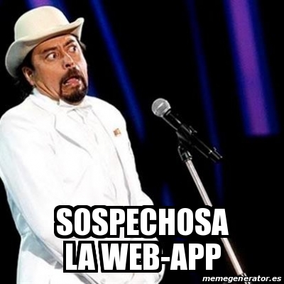

# { data-background="img/data-culture.jpg"}

## ¿Que haremos?

```{r, include = FALSE}
source("R/setup.R")
```

- ¿Qué es shiny?
- ¿Por qué shiny?
- ¿Por qué con estilo?
- Ejemplos <span class="fragment"> de la vida</span><span class="fragment"> real</span><span class="fragment"> común</span><span class="fragment"> y corriente</span><span class="fragment"> del día a día</span>

# ¿Qué es shiny? { .center .white data-background="#75AADB"}

## ¿Qué es shiny?

- Es un paquete para construir aplicaciones web usando solamente
código `r R()`
- De forma __fácil__<span class="fragment">. Sin aprender o saber de `HTML`</span><span class="fragment">, `Javascript`</span><span class="fragment"> `CSS`</span><span class="fragment"> frontend</span><span class="fragment"> o backend</span>

<span class="fragment"><iframe src="https://giphy.com/embed/12mPcp41D9a1i0" width="480" height="275" frameBorder="0" class="giphy-embed" allowFullScreen></iframe></span>

## ¿Cómo luce una _shiny-app_ en código?

```r
ui <- fluidPage(
   sidebarLayout(
      sidebarPanel(
        sliderInput("nrand", "Simulaciones",
                    min = 50, max = 100, value = 70),
        selectInput("col", "Color", c("red", "blue", "black")),
        checkboxInput("punto", "Puntos:", value = FALSE)
      ),
      mainPanel(plotOutput("outplot"))
   )
)

server <- function(input, output) {
   output$outplot <- renderPlot({
     set.seed(123)
     x <- rnorm(input$nrand)
     t <- ifelse(input$punto, "b", "l")
     plot(x, type = t, col = input$col)
   })
}
```

## ¿Cómo luce una _shiny-app_ funcionando?

<small>
http://104.140.247.162:3838/por-que-shiny-por-que-con-estilo/app-01-basico/
</small>

<iframe src="http://104.140.247.162:3838/por-que-shiny-por-que-con-estilo/app-01-basico/" width="100%" height="500px" ></iframe>

## Sospechosa



## ¿Cómo? 


## Contenedor 


## Otros contenedores 


## Inputs 


## Output(s!) 


## Interacción 


## Resultado 


## Me parece

<iframe src="https://giphy.com/embed/vgUFOWBwBkziE" width="480" height="270" frameBorder="0" class="giphy-embed" allowFullScreen></iframe>

# ¿Por qué shiny? { .center .white data-background="#F44336"}

## Educación 

<small>https://gallery.shinyapps.io/050-kmeans-example</small>

<iframe src="https://gallery.shinyapps.io/050-kmeans-example" width="100%" height="500px" ></iframe>

## _Showcase_ de trabajos

Paquete R para __X-13ARIMA-SEATS__ [`r ico("link")`](http://www.seasonal.website/)

<iframe src="http://www.seasonal.website/" width="100%" height="500px" ></iframe>

## Otra razones

- ¿Cuántos tienen su `r ico("mobile")` en la mano?
- ¿Cuántos siguen haciendo informes excel haciendo las resultados previos en `r R()`?
- Salir del confort y aprender un mundo nuevo donde el primer paso es pequeño

<span class="fragment"><iframe src="https://giphy.com/embed/2dJ5Iait4QrW8" width="480" height="311" frameBorder="0" class="giphy-embed" allowFullScreen></iframe></span>

# ¿Por qué con estilo? { .center .white data-background="#3F51B5"}

## ¿Por qué con estilo? 


## Alternativas para refrescar

- `shinythemes`
- `shinymaterial`
- `shinydashboard`
- ...`CSS`

<span class="fragment"><iframe src="https://giphy.com/embed/RrVzUOXldFe8M" width="480" height="360" frameBorder="0" class="giphy-embed" allowFullScreen></iframe></span>

## `shinythemes`

Los más fácil de implementar, sin tan alto impacto en código ni imagen.


## `shinythemes`

Antes:

```r
library(shiny)

ui <- fluidPage(
   sidebarLayout(...
```

Ahora:

```r
library(shiny)
library(shinythemes)

ui <- fluidPage(
   theme = shinytheme("superhero"),
   sidebarLayout(...
```

## `shinythemes`

<small>
http://104.140.247.162:3838/por-que-shiny-por-que-con-estilo/app-02-shinythemes/
</small>

<iframe src="http://104.140.247.162:3838/por-que-shiny-por-que-con-estilo/app-02-shinythemes/" width="100%" height="500px" ></iframe>

## `shinymaterial`

Basado en las normativas de diseño __Material Design__ desarrollado por Google para android


## `shinymaterial`

Se debe cambiar el `ui` `r ico("frown-o")`<span class="fragment">, pero no así el `server` `r ico("smile-o")`</span>

```r
library(shiny)
library(shinymaterial)

ui <- material_page(
  nav_bar_color = "blue",
  material_row(
    material_column(width = 4, 
      material_card(depth = 4,
        material_slider("nrand", "Simulaciones", min_value = 50,
                        max_value = 100, initial_value = 70),
        material_dropdown("col", "Color", c("red", "blue", "black")),
        material_checkbox("punto", "Puntos", initial_value = TRUE)
      )
    ),
    material_column(width = 8,
      material_card(plotOutput("outplot"), depth = 4)
    )
  )
)
```

## `shinymaterial`

<small>
http://104.140.247.162:3838/por-que-shiny-por-que-con-estilo/app-03-shinymaterial/
</small>

<iframe src="http://104.140.247.162:3838/por-que-shiny-por-que-con-estilo/app-03-shinymaterial/" width="100%" height="500px" ></iframe>

## `shinydashboard`

Orientados a __dashboards__<span class="fragment"> agrega más funcionalidades</span>


## `shinydashboard`

Cambio en el `ui`

```r
ui <- dashboardPage(
  dashboardHeader(),
  dashboardSidebar(
    sliderInput("nrand", "Simulaciones", min = 50, max = 100, value = 70),
    selectInput("col", "Color", c("red", "blue", "black")),
    checkboxInput("punto", "Puntos:", value = FALSE)
  ),
  dashboardBody(
    fluidRow(box(width = 12, plotOutput("outplot")))
  )
)
```

## `shinydashboard`

<small>
http://104.140.247.162:3838/por-que-shiny-por-que-con-estilo/app-04-shinydashboard/
</small>

<iframe src="http://104.140.247.162:3838/por-que-shiny-por-que-con-estilo/app-04-shinydashboard/" width="100%" height="500px" ></iframe>


## `CSS`

La libertad a cierto costo


## `CSS`

- Todos los paquetes anteriores viven dentro de sus diseños/márgenes
- `CSS` ofrece una libertad _infinita_
- Claro, tiempo hay que dedicarle

<span class="fragment"><iframe src="https://giphy.com/embed/tJeGZumxDB01q" width="480" height="360" frameBorder="0" class="giphy-embed" allowFullScreen></iframe></span>

## `CSS`

<small>
http://104.140.247.162:3838/por-que-shiny-por-que-con-estilo/app-04-shinydashboard/
</small>

<iframe src="http://104.140.247.162:3838/por-que-shiny-por-que-con-estilo/app-04-shinydashboard/" width="100%" height="500px" ></iframe>


# Una Historia { .center .white data-background="#607D8B"}

## Comienza Así


- El programa de Innovación de Alimentos + Saludables deseaba actualizar su
sitio en cuanto a diseño y contenido
- También agregar unos análisis que hacían... <span class="fragment">a mano</span>
- Consolidando cientos y cientos... <span class="fragment"> de planillas excel </span>

<span class="fragment"><iframe src="https://giphy.com/embed/12RfP2odT4hEOI" width="480" height="437" frameBorder="0" class="giphy-embed" allowFullScreen></iframe></span>

## Los análisis

- Se basaban en datos del UN Comtrade ( United Nations International Trade Statistics Database) y del OEC (Observatory of Economic complexity)
- Se tenían los datos de países (muchos!) y sus transacciones de productos (muchos!!!)
- El objetivo era comparar el posicionamiento de Chile respecto a sus competidores

## Los análisis

Imagen 1

## Los análisis

Imagen 2

## Iteracion N

link

## Iteracion N


