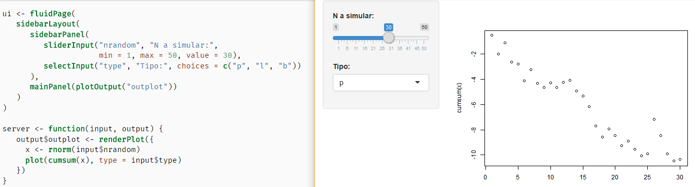

# { data-background="img/data-culture.jpg"}

```{r, include = FALSE}
source("R/setup.R")
```

## ¿Que haremos?

> - ¿Qué es shiny?
> - ¿Por qué shiny?
> - ¿Por qué con estilo?
> - Ejemplos <span class="fragment"> de la vida</span><span class="fragment"> real</span><span class="fragment"> común</span><span class="fragment"> y corriente</span><span class="fragment"> habitual</span>

# ¿Qué es shiny? { .center .white data-background="#F44336"}

## ¿Qué es shiny?

> - Es un paquete para construir aplicaciones web usando solamente
código `r R()`
> - De forma __fácil__<span class="fragment">. Sin aprender `HTML`</span><span class="fragment">, `Javascript`</span><span class="fragment"> o `CSS`</span>


## ¿Cómo luce una _shiny-app_ en código?

```r
library(shiny)

ui <- fluidPage(
   sidebarLayout(
      sidebarPanel(
         sliderInput("nrandom", "N a simular:",
                     min = 1, max = 50, value = 30),
         selectInput("type", "Tipo:", choices = c("p", "l", "b"))
      ),
      mainPanel(plotOutput("outplot"))
   )
)

server <- function(input, output) {
   output$outplot <- renderPlot({
     x <- rnorm(input$nrandom)
     plot(cumsum(x)/seq(length(x)), type = input$type)
   })
}
```

## ¿Cómo luce una _shiny-app_ funcionando?

<small>
http://104.140.247.162:3838/por-que-shiny-por-que-con-estilo/app-01-basico/
</small>

<iframe src="http://104.140.247.162:3838/por-que-shiny-por-que-con-estilo/app-01-basico/" width="100%" height="500px" ></iframe>

## Nice

<iframe src="https://giphy.com/embed/fDzM81OYrNjJC" width="480" height="286" frameBorder="0" class="giphy-embed" allowFullScreen></iframe><p><a href="https://giphy.com/gifs/happy-excited-shocked-fDzM81OYrNjJC">via GIPHY</a></p>

## What



