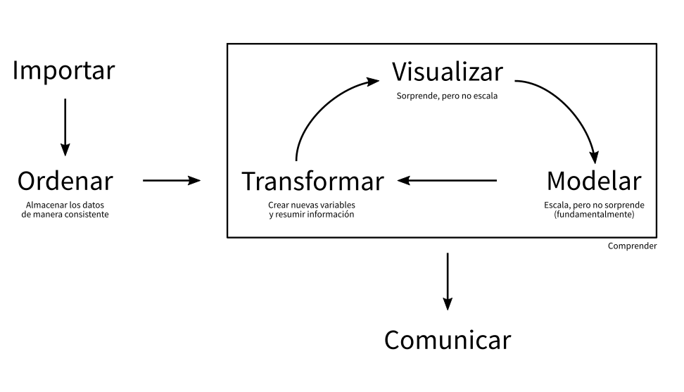

class: center, middle, clear, bkgd-red

```{r setup, include=FALSE}
options(htmltools.dir.version = FALSE)
try(source("setup.R"))
try(source("201812-visualizacion-de-datos-desde-la-estadistica/setup.R"))

```

# Contexto


---

# Contexto

La visualización en el Análisis de Datos



---

# Contexto

La visualización codifica información


---

background-image: url(https://wallpaperplay.com/walls/full/8/b/9/112119.jpg)

# Ejemplo 

---

# Ejemplo

```{r, cache=TRUE}
legos <- read_csv("https://raw.githubusercontent.com/seankross/lego/master/data-tidy/legosets.csv") %>% 
  mutate(year2 = floor(Year/10)*10) %>% 
  sample_n(3000)

p <- ggplot(legos) + 
  # geom_point(aes(Pieces, USD_MSRP, size = Minifigures, color = Year), alpha = 0.5) +
  scale_y_sqrt(labels = scales::dollar, limits = c(0, 300)) +
  scale_x_sqrt(labels = scales::comma, limits = c(0, 2000)) +
  labs(title = "Distribución de Set de Legos", x = "Piezas", y = "Precio USD")

p + geom_point(aes(Pieces, USD_MSRP), alpha = 0.25, size = 1)
```

---

# Ejemplo

```{r}
p + geom_point(aes(Pieces, USD_MSRP, size = Minifigures), alpha = 0.25)
```

---

# Ejemplo

```{r}
p + 
  geom_point(aes(Pieces, USD_MSRP, size = Minifigures, color = Year), alpha = 0.5) +
  scale_color_viridis_c(option = "B", breaks = c(1970, 1990, 2010)) 
```

---

# Ejemplo

```{r}
ggplot(legos) +
  geom_jitter(aes(factor(year2), USD_MSRP, size = Pieces, color = Year), alpha = 0.5, width = 0.25) +
  scale_color_viridis_c(option = "A", breaks = c(1970, 1990, 2010)) + 
  scale_y_continuous(name = "Precio USD", labels = scales::dollar, limits = c(0, 300)) + 
  scale_x_discrete(name = "Década") +
  labs(title = "Precios/Década")
```

---

class: center, middle, clear, bkgd-light-blue

# Visualización Efectiva & Buenas Prácticas


---

# Ejercicio

¿Existe el mejor gráfico?
¿Cuál de las siguientes formas funciona mejor con el título?

--

"La región del sur exhibe el mayor crecimiento"

--

```{r}
library(readxl)
try(data1 <- read_excel("data/muestrame_los_numeros.xlsx"))
try(data1 <- read_excel("201812-visualizacion-de-datos-desde-la-estadistica/data/muestrame_los_numeros.xlsx"))

data1 <- data1 %>% 
  mutate(region = factor(region, levels = c("sur", "norte", "este", "oeste")))
titulo <- "La región del sur exhibe el mayor crecimiento"

data1 %>% 
  spread(cuarto, valor) %>% 
  arrange(region) %>% 
  knitr::kable(format = "html")
```

---

# Ejercicio - Opción #1

```{r}
p1 <- ggplot(data1) +
  geom_col(aes(cuarto, valor, group = region, fill = region),
           color = "gray80", position = "dodge") +
  scale_fill_viridis_d(option = "B", end = 0.90)
p1 + labs(title = titulo)
```

---

# Ejercicio - Opción #2

```{r}
p2 <- ggplot(data1) +
  geom_col(aes(region, valor, group = cuarto, fill = region),
           color = "gray80", position = "dodge") +
  scale_fill_viridis_d(option = "B", end = 0.90)
p2 + labs(title = titulo)
```

---

# Ejercicio - Opción #3

```{r}
p3 <- data1 %>% 
  mutate(ind = as.numeric(region == "sur")) %>%
  ggplot() +
  geom_line(aes(cuarto, valor, group = region, alpha = ind, color = region), size = 2.5) +
  scale_y_continuous(limits = c(0, NA)) + 
  scale_alpha(range = c(0.5, 1), guide = FALSE) +
  scale_color_viridis_d(option = "B", end = 0.90)
p3 + labs(title = titulo)
```

---

# Ejercicio - Entonces?

```{r, fig.width=12}
gridExtra::grid.arrange(
  p1 + theme(axis.text.y = element_blank(), legend.position="none") + ylab(NULL),
  p2 + theme(axis.text.y = element_blank(), legend.position="none") + ylab(NULL),
  p3 + theme(axis.text.y = element_blank(), legend.position="none") + ylab(NULL),
  nrow = 1)
```

--

(Posible) Respuesta: __No. Dependerá de tu mensaje__

---

# Pie Charts

<!-- https://twitter.com/MetricsHulk/status/728014668913102848 -->


--

Usuales dificultades: Compara áreas, y rotar
para comparar 

---

# Muy usado es el __pie chart__

```{r}
legos2 <- legos %>% 
  mutate(Theme2 = fct_lump(Theme, n = 7)) %>% 
  filter(Theme2 != "Other")
  
p1 <- ggplot(legos2) +
  geom_bar(aes(Theme, fill = Theme)) +
  scale_fill_viridis_d(option = "B", end = 0.7) +
  theme_null() + 
  xlab(NULL) + ylab(NULL)

p2 <- ggplot(legos2) +
  geom_bar(aes(x = factor(1), fill = Theme), width = 1) +
  scale_fill_viridis_d(option = "B", end = 0.7) +
  coord_polar(theta = "y") +
  theme_null()

gridExtra::grid.arrange(p1, p2, nrow = 1)
```

---

# Muy (ab)usado es el __pie chart__

```{r}
legos3 <- legos %>% 
  mutate(Theme2 = fct_lump(Theme, n = 15)) %>% 
  filter(Theme2 != "Other")

p1 <- ggplot(legos3) +
  geom_bar(aes(Theme, fill = Theme)) +
  scale_fill_viridis_d(option = "B") +
  theme_null() + 
  xlab(NULL) + ylab(NULL)

p2 <- ggplot(legos3) +
  geom_bar(aes(x = factor(1), fill = Theme), width = 1) +
  scale_fill_viridis_d(option = "B") +
  coord_polar(theta = "y") +
  theme_null()

gridExtra::grid.arrange(p1, p2, nrow = 1)
```

---

# Dejar el Pie para el _postre_


---

# Convenciones

Encuentre las anomalías

--

.center[


]


---

# Convenciones

Rápidamente ¿Dónde se produce el máximo de muertes por arma?

--

.center[


]


---

# Tipografías


---

# Colores

La misma idea de las convenciones!

--

.center[

<h1>
<span style="color:gray">1 2 3 8 9 </span><span style="color:red">4</span><span style="color:gray">1 4</span>
</h1>

]


--

- Dar foco y llamar la atención
--

- Debiesen ser corcondantes con el dato

---

class: center, middle, clear, bkgd-green

# Poniendo en práctica


---

# Datos

Ingresos de usuarios a estaciones de metros (+100) cada media hora

```{r, cache=TRUE}
data <- read_delim(url("https://tinyurl.com/data-metro-scl"), delim = ";")
data <- data %>% 
  filter(!str_detect(paraderosubida, "[0-9]+-[0-9]")) %>% 
  filter(paraderosubida != "-") %>% 
  filter(lubridate::hour(mediahora) > 0)

knitr::kable(head(data, 5), format = "html")
```

--

La idea es obtener conocimiento de estos datos

---

# Simple

```{r}
p <- data %>% 
  filter(paraderosubida == "ALCANTARA") %>% 
  ggplot() +
  scale_color_viridis_d()

p +
  geom_point(aes(subidas_laboral_promedio, mediahora, color = paraderosubida))
```

--

Es bueno equivocarse

---

# Simple 2


```{r}
p +
  geom_line(aes(mediahora, subidas_laboral_promedio, color = paraderosubida))
```

---

# Menos simple

```{r}
d1 <- filter(data, paraderosubida %in% c("PLAZA MAIPU", "LAGUNA SUR")) 
gridExtra::grid.arrange(
  ggplot(d1) +
    geom_line(aes(mediahora, subidas_laboral_promedio, color = paraderosubida, group = paraderosubida)) +
    scale_y_continuous(label = scales::comma) +
    scale_color_viridis_d(option = "A", end = 0.8),
  d1 %>% 
    spread(paraderosubida, subidas_laboral_promedio) %>% 
    ggplot(aes(`LAGUNA SUR`, `PLAZA MAIPU`, label = format(mediahora, "%H:%m"))) +
    geom_point(alpha = 0.4) +
    geom_text_repel(data = . %>% head(10) %>% sample_n(5), force = 10) +
    scale_y_continuous(label = scales::comma) +
    scale_x_continuous(label = scales::comma),
  nrow = 1
  )
  
c <- d1 %>% 
  spread(paraderosubida, subidas_laboral_promedio) %>%
  filter(complete.cases(.)) %>% 
  select(-1) %>%
  as.matrix() %>% 
  cor() %>% 
  as.vector() %>% 
  nth(2)
```

--

correlación: `r round(c, 3)`

---

# Menos simple 2

```{r}
d1 <- filter(data, paraderosubida %in% c("UNIVERSIDAD DE CHILE", "PLAZA DE PUENTE ALTO")) 
gridExtra::grid.arrange(
  ggplot(d1) +
    geom_line(aes(mediahora, subidas_laboral_promedio, color = paraderosubida, group = paraderosubida)) +
    scale_color_viridis_d(option = "A", end = 0.8) +
    scale_y_continuous(label = scales::comma),
  d1 %>% 
    spread(paraderosubida, subidas_laboral_promedio) %>% 
    ggplot(aes(`UNIVERSIDAD DE CHILE`, `PLAZA DE PUENTE ALTO`, label = format(mediahora, "%H:%m"))) +
    geom_point(alpha = 0.4) +
    geom_text_repel(data = . %>% head(10) %>% sample_n(5), force = 10) +
    scale_y_continuous(label = scales::comma) +
    scale_x_continuous(label = scales::comma),
  nrow = 1
  )
  
c <- d1 %>% 
  spread(paraderosubida, subidas_laboral_promedio) %>%
  filter(complete.cases(.)) %>% 
  select(-1) %>%
  as.matrix() %>% 
  cor() %>% 
  as.vector() %>% 
  nth(2)
```

--

correlación: `r round(c, 3)`


---

# Correlaciones

Las correlaciones nos dan una métrica de que tanto
se parecen unas estaciones de otras

--

¿Las obtenemos todas y graficamos?

---

# Correlaciones 2

```{r}
dcor <- data %>%
  widyr::pairwise_cor(
    paraderosubida,
    mediahora,
    subidas_laboral_promedio
    )

ggplot(dcor) +
  geom_tile(aes(item1, item2, fill = correlation)) + 
  scale_fill_viridis_c(option = "B") +
  theme(
    axis.text.y = element_text(size = 2),
    axis.text.x = element_text(size = 2, angle = 90, hjust = 1),
    legend.position = "none"
    ) +
  labs(x = NULL, y = NULL)
```

---

# Correlaciones 3

```{r}
M <- data %>% 
  spread(paraderosubida, subidas_laboral_promedio) %>% 
  select(-1) %>% 
  mutate_all(replace_na, 0) %>% 
  cor()

order <- corrplot::corrMatOrder(M, order = "hclust")
M <- M[order, order]

lvls <- colnames(M)

dcor <- dcor %>% 
  mutate_if(is.character, factor, levels = lvls)

ggplot(dcor) +
  geom_tile(aes(item1, item2, fill = correlation)) + 
  scale_fill_viridis_c(option = "B") +
  theme(
    axis.text.y = element_text(size = 2),
    axis.text.x = element_text(size = 2, angle = 90, hjust = 1),
    legend.position = "none"
    ) +
  labs(x = NULL, y = NULL)
```

---

# Correlaciones 4


```{r}
library(igraph)
library(ggnetwork)

dcorf <- dcor %>%
  filter(as.character(item1) < as.character(item2)) %>% 
  arrange(desc(correlation)) %>% 
  mutate(w = correlation*correlation) %>% 
  head(250)

# ggplot(dcorf) + geom_histogram(aes(w))
g <- graph_from_data_frame(dcorf, directed = FALSE)

E(g)$weight <- dcorf$w

wc <- cluster_fast_greedy(g)
nc <- length(unique(membership(wc)))

dvert <- data_frame(
  paraderosubida = V(g)$name
  ) %>% 
  mutate(
    comm = membership(wc)
  ) %>% 
  left_join(
    data %>%
      group_by(paraderosubida) %>%
      summarise(n = sum(subidas_laboral_promedio))
    ) %>% 
  left_join(
    data %>%
      group_by(paraderosubida) %>% 
      summarise(tend = cor(seq(1, n()), subidas_laboral_promedio))
    ) %>% 
  ungroup()

V(g)$label <- dvert$paraderosubida
V(g)$size <- dvert$n
V(g)$subidas_totales_miles <- round(dvert$n/1000, 2)
V(g)$comm <- membership(wc)
V(g)$tendencia <- round(dvert$tend, 2)
V(g)$color <- dvert$comm

set.seed(123)

ggnet <- ggnetwork(g)
dfnet2 <- ggnet %>%
  as.matrix() %>%
  as.data.frame() %>%
  tbl_df() %>%
  select(x, y, vertex.names, weight, size, color) %>%
  mutate_all(as.character) %>%
  mutate_at(vars(x, y, weight, size), as.numeric) %>%
  filter(is.na(weight))

ggplot(ggnet) + 
  geom_edges(aes(x, y, size = width, color = factor(comm),
           xend = xend, yend = yend), color = "gray", size = 1, alpha = 0.25) +
  geom_point(aes(x, y, size = size, color = factor(comm))) +
  geom_text_repel(aes(x, y, label = vertex.names), size = 2,
                  data = dfnet2, color = "#666666",
                  force = 10,
                  family = "Roboto Condensed") +
  scale_color_viridis_d() + 
  theme_blank() +
  labs(size = "Subidas", color = "Comunidad")
```

---

# Reducción De dimensionalidad

--

Hasta ahora hemos usado solamente *correlaciones* que miden asociacion lineal 
y no es um indicador necesariamente robusto para usarlo como métrica de distancia

--

Usaremos todos los datos por estacion y usaremos __UMAP__, un algoritmo 
para _resumir_ toda la información en *2* columnas/variables

--

Similares son: PCA, T-SNE, Autoencoders

---

# Reducción De dimensionalidad
 
Lleva de

```{r}
datas <- data %>% 
  spread(mediahora, subidas_laboral_promedio)
datas <- datas %>% 
  mutate_if(is.numeric, replace_na, 0)

datas %>% 
  select(1:6) %>% 
  head(3) %>% 
  knitr::kable(format = "html")
```

A

```{r}
library(uwot)

um <- umap(datas, verbose = TRUE, n_threads = 2)

umd <- as.data.frame(um) %>% 
  tbl_df() %>% 
  mutate(paraderosubida = pull(datas, paraderosubida)) %>% 
  select(paraderosubida, everything())

umd %>% 
  head(3) %>% 
  knitr::kable(format = "html")
```

---

# Reducción De dimensionalidad

```{r}
ggplot(umd) +
  geom_point(aes(V1, V2), alpha = 0.3) +
  geom_text_repel(aes(V1, V2, label = paraderosubida),
                  data = . %>% sample_n(30),
                  size = 3,
                  force = 10) 
```

---

# Reducción De dimensionalidad

```{r}
library(ggdendro)
rownames(umd) <- pull(umd, paraderosubida)
hcd <- hclust(dist(umd))

hc       <- hclust(dist(umd), "ave")           # heirarchal clustering
dendr    <- dendro_data(hc, type="rectangle") # convert for ggplot
clust    <- cutree(hc, k = 4)                    # find 2 clusters
clust.df <- data.frame(label = names(clust), cluster = factor(clust))
dendr[["labels"]] <- merge(dendr[["labels"]], clust.df, by = "label")
ggplot() + 
  geom_segment(data=segment(dendr), aes(x=x, y=y, xend=xend, yend=yend)) + 
  geom_text(data=label(dendr), aes(x, y, label=label, hjust=1, color=cluster), 
           size=1) +
  coord_flip() + 
  scale_color_viridis_d() +
  scale_y_continuous(limits = c(-1.5, NA)) + 
  # scale_y_reverse(expand=c(0.2, 0)) + 
  theme(axis.line.y=element_blank(),
        axis.ticks.y=element_blank(),
        axis.text.y=element_blank(),
        axis.title.y=element_blank(),
        panel.background=element_rect(fill="white"),
        panel.grid=element_blank())
```

---

# Reducción De dimensionalidad

```{r}
umd2 <- umd %>% 
  left_join(clust.df, by = c("paraderosubida" = "label")) 

ggplot(umd2) +
  geom_point(aes(V1, V2, color = cluster), alpha = 0.8) +
  scale_color_viridis_d() +
  geom_text_repel(aes(V1, V2, label = paraderosubida),
                  data = . %>% sample_n(20),
                  size = 3,
                  force = 10) 
```

---

# Finalmente

```{r}
data %>% 
  left_join(umd2 %>% select(paraderosubida, cluster)) %>% 
  ggplot(aes(mediahora, subidas_laboral_promedio)) +
  geom_line(aes(group = paraderosubida), alpha = 0.1, size = 1) +
  geom_smooth(aes(color = cluster), se = FALSE, size = 2) + 
  scale_color_viridis_d() +
  facet_wrap(vars(cluster))
```

---

class: center, middle, clear, bkgd-amber

# Resumiendo

---

# Resumiendo

La visualización...

- Lleva información, mensaje
--

- Ejercicio mental para decodificar información
--

- No siempre es el fin
--

- Herramienta exploratoria
--

- Distintas visualizaciones en mismos datos son distintas historias
--


Y todo mejora, cuando agregamos un poco más de metodologías
cuantitavias o predicitivas!

---

class: center, middle, clear, bkgd-green

# Gracias