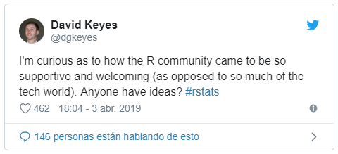

```{r, include=FALSE}
knitr::opts_chunk$set(dev = "svg", fig.align = "center", fig.height = 4)
```


class: inverse, middle, center

# Hola! <br> ¿R? ¿Programar? <br> ¿Preguntas y respuestas? <br> ¿Que haremos?


---

class: middle, center

# <span style='color:white'>http://jkunst.com/r-material/201904-welcome-to-our-joint-meetup%20data-viz-beginner-to-expert/#1</span>


---

class: inverse, middle, center

# Principiantes

---

# Antes de Partir!

<blockquote class="twitter-tweet" data-lang="es"><p lang="en" dir="ltr">I&#39;m curious as to how the R community came to be so supportive and welcoming (as opposed to so much of the tech world). Anyone have ideas? <a href="https://twitter.com/hashtag/rstats?src=hash&amp;ref_src=twsrc%5Etfw">#rstats</a></p>&mdash; David Keyes (@dgkeyes) <a href="https://twitter.com/dgkeyes/status/1113547867984027648?ref_src=twsrc%5Etfw">3 de abril de 2019</a></blockquote>
<script async src="https://platform.twitter.com/widgets.js" charset="utf-8"></script>

```{r, echo=FALSE}

```

---

# Donde todos comenzamos!

```{r}
datos <- c(1, 8, 5, 6, 7)

plot(datos)
```

---

# Todavía en los 80s

```{r}
plot(datos, type = "l", main = "Mi primer grafico :)")
```

---

# `plot` es mágico


```{r}
data("AirPassengers") # series de tiempo ¿?
plot(AirPassengers)
```

---

# `plot` es poderoso

```{r}
plot(density(datos))
```

---
background-image: url(https://image.shutterstock.com/image-photo/portrait-asian-boy-glasses-showing-260nw-454434301.jpg)


---

class: inverse, middle, center

# Intermedio

---

class: inverse, middle, center

# ¿Intermedio?

---

class: inverse, middle, center

# ¿Intermedio? <br> ¿Existe?

---

class: inverse, middle, center

# Avanzado

---

# Avanzado


- ggplot2
- htmlwidgets

--

Go go!


