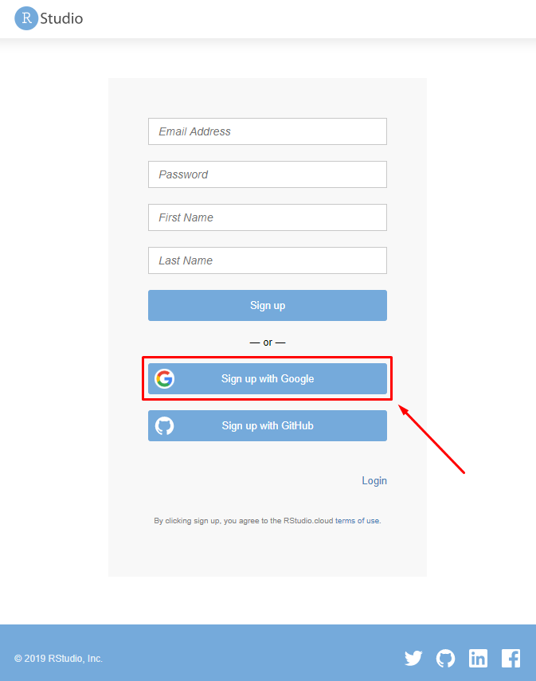
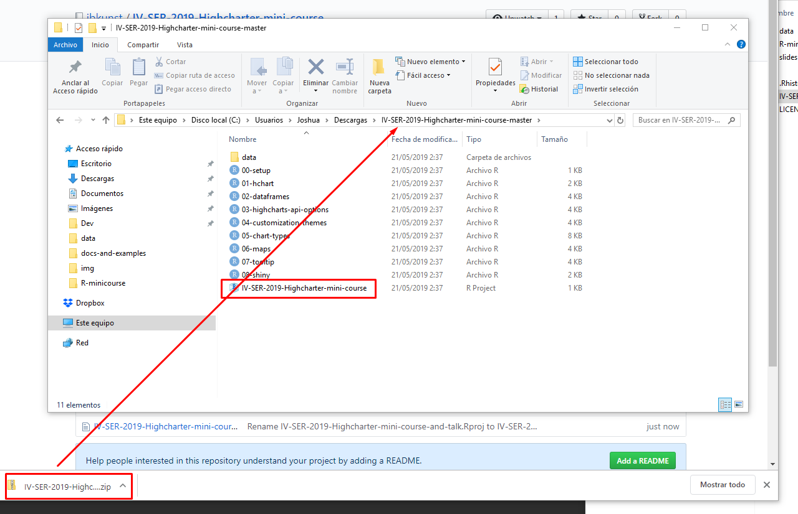
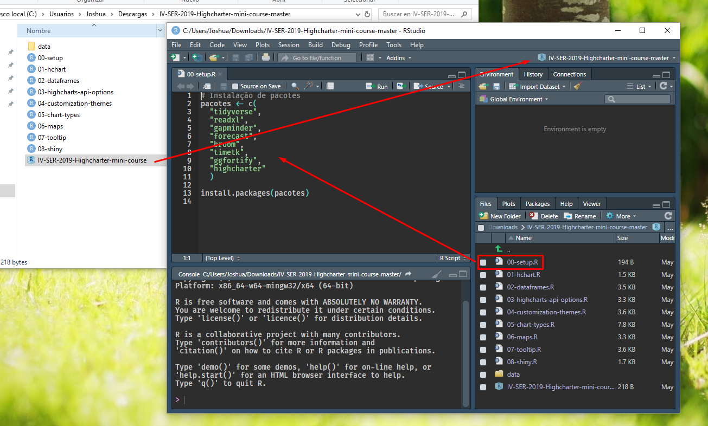

---
output:
  revealjs::revealjs_presentation:
    self_contained: false
    lib_dir: libs
    css: ["libs/css/styles.css"]
    mathjax: null
    transition: fade
    incremental: true
    center: false
    theme: simple
    fig_width: 5
    fig_height: 4
    reveal_options:
      slideNumber: true
      controls: false
      mouseWheel: false
editor_options: 
  chunk_output_type: console
---

# <span class="impo"><span style="color:#BD0607;font-size:0.8em">Mission:Possible</span><br><span style="color:#E9E2DF">Datavisualization with highcharts: From beginner to expert</span></span>  {.center data-background="#020102"}

<!-- title: "<div id=\"brand\">h|1i|0g|3h|2c|1h|2a|1r|3t|2e|1r|2{userchile}</div>" -->
<!-- author: "<div id=\"subbrand\">Joshua Kunst, Julio 2017</div>" -->


```{r, include = FALSE}
source(here::here("slides/R/setup.R"))
```

## `r ico("hand-paper-o", "#ff0033", class="greeting")`, Ola. Eu sou joshua 

- Analista em um banco 
- `highcharter` creator
- `r ico("heart", "read", class="pulse")` `r R()`

## Material e código <br> https://github.com/jbkunst/IV-SER-2019-Highcharter-mini-course { .center }

## Como posso trabalhar? <br>  2 opções!!!! { .center }

# Primeira opção, o fácil <br> rstudio.cloud { .center .white data-background="#4C83B6" }

## 1. go to rstudio.cloud



## 2. Novo projeto 


## 3. https://github.com/jbkunst/IV-SER-2019-Highcharter-mini-course


## Espera


## Pronto! Pacotes!


# Segundo opção <br> Local/Github { .center .white data-background="#24292E"}

## 1. Github and download 

https://github.com/jbkunst/IV-SER-2019-Highcharter-mini-course


## Unzip



## Pronto! Pacotes!



