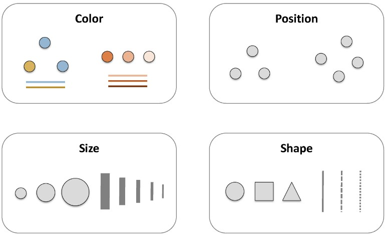
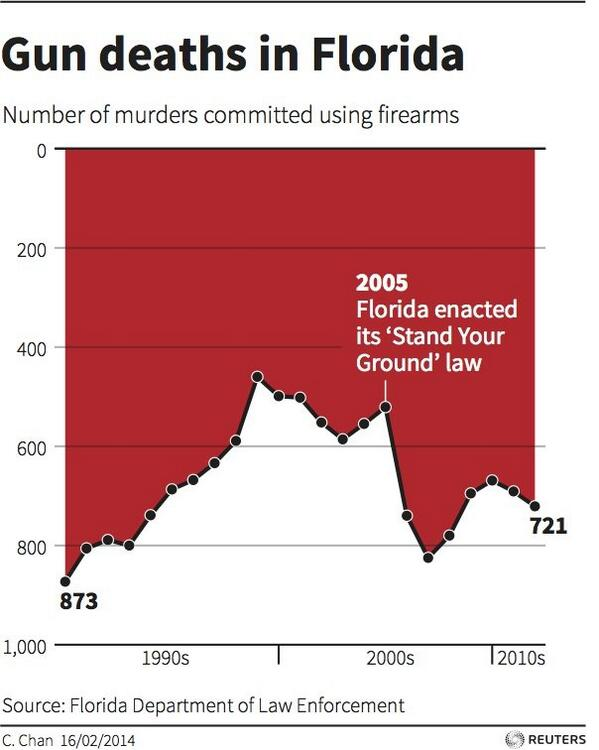

# Diplomado Visualización de Datos<br>R, estadística descriptiva, ggplot2<br><small>Pacha & Joshua Kunst, 2019</small>{ .center .white data-background="#75AADB" }

```{r, include = FALSE}
source("R/setup.R")
knitr::opts_chunk$set(fig.path = "static/img/", echo = TRUE, cache = TRUE)
```

## Importante!!!


https://es.r4ds.hadley.nz/

https://www.meetup.com/es/rladies-scl/

https://twitter.com/hashtag/datosdemiercoles?src=hash

https://github.com/rivaquiroga/RLadies-Santiago/blob/master/2018-04_taller_primeros_pasos_en_R.Rmd


## ¿Por que visualización?


----


<!-- https://twitter.com/sdbernard/status/946701218298126341  -->

## Definición técnica (Posible)

Representación gráfica de datos __codificando la información__ como: posición, tamaño, formas, colores



----

Muchos sabores:


----

Cosas importantes sobre visualización de datos:

- Lleva información, es un mensaje
- Ejercicio mental para interpretar o _decodificar_(!!) información
- No siempre es el fin
- Herramienta exploratoria
- Distintas visualizaciones en mismos datos / Distintas historias

----

```{r}
library(tidyverse)
library(scales)
data(gapminder, package = "gapminder")

dg <- gapminder %>% 
  distinct(country, continent) %>% 
  count(continent)

p <- ggplot(dg) +
  geom_col(aes(continent, n, fill = continent), width = 0.5) + 
  scale_fill_viridis_d(option = "D", guide = FALSE) +
  labs(
    title = "Africa tiene más países que el resto de continentes",
    subtitle = "Un interesante subtitulo para contexto y dar detalles quizás puede ser\nmás largo pero quien soy yo para decir que se debe y lo que no",
    caption = "Importante mencionar la fuente, en caso contrario no me creen",
    x = "Contienentes",
    y = "Países"
    ) + 
  theme(plot.subtitle = element_text(size = 9))
```

----

```{r, echo=FALSE}
p
```

----

```{r}
dg2 <- gapminder %>% 
  group_by(country) %>% 
  filter(row_number() == n()) %>% 
  ungroup()

p2 <- ggplot(dg2) + 
  geom_point(aes(lifeExp, gdpPercap, size = pop, color = continent), alpha = 0.7) +
  scale_color_viridis_d(option = "A") + 
  scale_y_sqrt(name = "GDP per Capita", labels = comma, limits = c(NA, NA)) +
  scale_x_continuous(name = "Esperanza de vida", labels = comma, limits = c(NA, NA)) +
  scale_size(labels = comma, range = c(3, 10), breaks = c(100, 1000, 2000)*1e6) +
  labs(title = "Esperanza de vida y GDP per capita ")
```

----

```{r, echo=FALSE}
p2
```

----

```{r}
legosets <- read_csv("https://raw.githubusercontent.com/seankross/lego/master/data-tidy/legosets.csv")

p3 <- ggplot(legosets) + 
  geom_point(aes(Pieces, USD_MSRP, size = Minifigures, color = Year), alpha = 0.7) +
  scale_color_viridis_c(option = "A") + 
  scale_y_sqrt(name = "Precio USD", labels = dollar, limits = c(0, 300)) +
  scale_x_sqrt(name = "Piezas", labels = comma, limits = c(0, 2000)) +
  labs(title = "Precios según piezas")
```

----

```{r, echo=FALSE}
p3
```

----

```{r}
lg2 <- legosets %>% 
  mutate(year2 = floor(Year/10)*10) %>% 
  select(year2, Year, everything())

p4 <- ggplot(lg2) +
  geom_jitter(aes(factor(year2), USD_MSRP, size = Pieces, color = Year), alpha = 0.5, width = 0.25) +
  scale_color_viridis_c(option = "A") + 
  scale_y_continuous(name = "Precio USD", labels = dollar, limits = c(0, 300)) + 
  scale_x_discrete(name = "Década") +
  labs(title = "Precios/Década")
```

----

```{r, echo=FALSE}
p4
```


## Ejercicio

¿Existe el mejor gráfico? ¿Cuál de las siguientes formas funciona mejor con el títutlo?

__La región del sur exhibe el mayor crecimiento__

<br>
<small>
Adapatado del tweet de [Lisa Charlotte Rost](https://twitter.com/lisacrost/status/948233069110222848)
que a su vez está viene del ejemplo del libro "Show me the numbers" de Stephen Few
</small>
</span>

----

Los datos:

```{r, echo=FALSE}
library(readxl)
data1 <- read_excel("data/muestrame_los_numeros.xlsx") %>% 
  mutate(region = factor(region, levels = c("sur", "norte", "este", "oeste")))
titulo <- "La región del sur exhibe el mayor crecimiento"
data1 %>% 
  spread(cuarto, valor) %>% 
  arrange(region) %>% 
  knitr::kable()
```

----

Opción #1

```{r, echo=FALSE}
p1 <- ggplot(data1) +
  geom_col(aes(cuarto, valor, group = region, fill = region),
           color = "gray80", position = "dodge") +
  scale_fill_viridis_d(option = "B", end = 0.90)
p1 + labs(title = titulo)
```

----

Opción #2

```{r, echo=FALSE}
p2 <- ggplot(data1) +
  geom_col(aes(region, valor, group = cuarto, fill = region),
           color = "gray80", position = "dodge") +
  scale_fill_viridis_d(option = "B", end = 0.90)
p2 + labs(title = titulo)
```

----

```{r, echo=FALSE}
p3 <- data1 %>% 
  mutate(ind = as.numeric(region == "sur")) %>%
  ggplot() +
  geom_line(aes(cuarto, valor, group = region, alpha = ind, color = region), size = 2.5) +
  scale_y_continuous(limits = c(0, NA)) + 
  scale_alpha(range = c(0.5, 1), guide = FALSE) +
  scale_color_viridis_d(option = "B", end = 0.90)
p3 + labs(title = titulo)
```

----

<br>

```{r, echo=FALSE, fig.width=12}
gridExtra::grid.arrange(
  p1 + theme(axis.text.y = element_blank(), legend.position="none"),
  p2 + theme(axis.text.y = element_blank(), legend.position="none"),
  p3 + theme(axis.text.y = element_blank(), legend.position="none"),
  nrow = 1)
```

----

(Posible) Respuesta

__No. Dependerá de tu mensaje, de tu historia.__

# Recomendaciones Técnicas <br> y algunas Misceláneas { .center .white data-background="#75AADB" }

## Pie Charts (o tortas)

<!-- https://twitter.com/MetricsHulk/status/728014668913102848 -->


----

Usuales dificultades

- Compara áreas
- Ejercicio mental de rotar para comparar categorías

----

Es muy usado es el __pie chart__

```{r, echo=FALSE}
legos2 <- legosets %>% 
  mutate(Theme2 = fct_lump(Theme, n = 7)) %>% 
  filter(Theme2 != "Other")
  
p1 <- ggplot(legos2) +
  geom_bar(aes(Theme, fill = Theme)) +
  scale_fill_viridis_d(option = "B", end = 0.7) +
  theme_null() + 
  xlab(NULL) + ylab(NULL)

p2 <- ggplot(legos2) +
  geom_bar(aes(x = factor(1), fill = Theme), width = 1) +
  scale_fill_viridis_d(option = "B", end = 0.7) +
  coord_polar(theta = "y") +
  theme_null()

gridExtra::grid.arrange(p1, p2, nrow = 1)
```

----

Es muy (__ab__)usado es el __pie chart__

```{r, echo=FALSE}
legos3 <- legosets %>% 
  mutate(Theme2 = fct_lump(Theme, n = 15)) %>% 
  filter(Theme2 != "Other")

p1 <- ggplot(legos3) +
  geom_bar(aes(Theme, fill = Theme)) +
  scale_fill_viridis_d(option = "B") +
  theme_null() + 
  xlab(NULL) + ylab(NULL)

p2 <- ggplot(legos3) +
  geom_bar(aes(x = factor(1), fill = Theme), width = 1) +
  scale_fill_viridis_d(option = "B") +
  coord_polar(theta = "y") +
  theme_null()

gridExtra::grid.arrange(p1, p2, nrow = 1)
```

----


## Puntos de Referencia

----

<br>


----

<br>


----

```{r, echo=FALSE}
data2 <- data_frame(
  indice = c(30.7, 22.8, 27.3),
  tiempo = c(2010, 2013, 2016),
  c = c("r", "b", "r")
)

ggplot(data2, aes(factor(tiempo), indice)) + 
  geom_col(aes(fill = c), width = 0.65) +
  geom_text(aes(label = paste0(indice, "%")), color = "white", size = 5, vjust = 2) +
  scale_fill_manual(values = c("navy", "darkred")) +
  labs(x = "Año", y = "Índice") + 
  theme(axis.text.y = element_blank(), legend.position="none")
```

## Convenciones

Ejercicio 2. Encuentre las _anomalías_

<!-- https://twitter.com/MetricsHulk/status/735913911212515329 -->


----

Rápidamente ¿Dónde se produce el máximo?



----

Mas de lo mismo:

https://twitter.com/lizardbill/status/1127005323636686848/photo/1


## Tipografía

¿Conocen a ...?

<span class="fragment"><h1><font face="Arial">Arial</font></h1></span>
<span class="fragment"><h1><font face="Times New Roman">Times New Roman</font></h1></span>
<span class="fragment"><h1><font face="Comic Sans MS">Comic Sans</font></h1></span>

----


----

Según <font face="Comic Sans MS">[comic sans criminal](http://www.comicsanscriminal.com/)</font>:

- Fuentes tienen personalidad
- Tiene un propósito
- Armonía en el universo

## Colores

La misma idea de las convenciones!

<h1><big><strong>
1 2 3 <span style="color:red">4</span> 5 6
</strong></big></h1>

- Dar foco y llamar la atención
- Debiesen ser corcondantes con el dato

----

```{r}
df <- data_frame(
  pais = c("Chile", "Colombia", "Argentina", "Bolivia"),
  crecimiento = c(6, 5, 4, 4)/10
) %>% 
  mutate(pais = fct_inorder(pais))

p5 <- ggplot(df) +
  geom_col(aes(pais, crecimiento, fill = pais), width = 0.5) + 
  scale_y_continuous(labels = percent) +
  scale_fill_manual(values = sample(c("#C8152B", "#FDD116", "#4F75AF", "#2C9A05"))) +
  theme(legend.position = "none")
```

----

```{r, echo=FALSE}
p5
```

----

```{r}
p6 <- ggplot(df) +
  geom_col(aes(pais, crecimiento, fill = pais), width = 0.5) +
  scale_y_continuous(labels = percent) +
  scale_fill_manual(values = c("#C8152B", "#555555", "#555555", "#555555")) +
  theme(legend.position = "none")
```

----

```{r, echo=FALSE}
p6
```

----

```{r}
p7 <- ggplot(legosets) + 
  geom_point(aes(Pieces, USD_MSRP, size = Minifigures, color = Year), alpha = 0.7) +
  scale_color_viridis_c(option = "A") + 
  scale_y_sqrt(name = "Precio USD", labels = dollar, limits = c(0, 300)) +
  scale_x_sqrt(name = "Piezas", labels = comma, limits = c(0, 2000)) +
  labs(title = "Precios según piezas")
```

----

```{r, echo=FALSE}
p7
```

----

```{r}
lg3 <- legosets %>% 
  mutate(Themesw = Theme == "Star Wars")

p8 <- ggplot(lg3) + 
  geom_point(aes(Pieces, USD_MSRP, size = Minifigures, color = Themesw), alpha = 0.7) +
  scale_color_manual(guide = "none", values = c("gray90", "darkred")) + 
  scale_y_sqrt(name = "Precio USD", labels = dollar, limits = c(0, 300)) +
  scale_x_sqrt(name = "Piezas", labels = comma, limits = c(0, 2000)) +
  labs(title = "Precios según piezas")
```

----

```{r, echo=FALSE}
p8
```


## Etiquetas

----

```{r}
p9 <- ggplot(dg2) + 
  geom_point(aes(lifeExp, gdpPercap, size = pop, color = continent), alpha = 0.7) +
  scale_color_viridis_d(option = "A") + 
  scale_y_sqrt(name = "GDP per Capita", labels = comma, limits = c(NA, NA)) +
  scale_x_continuous(name = "Esperanza de vida", labels = comma, limits = c(NA, NA)) +
  scale_size(labels = comma, range = c(3, 10), breaks = c(100, 1000, 2000)*1e6) +
  labs(title = "Esperanza de vida y GDP per capita ")
```

----

```{r, echo=FALSE}
p9
```

----

```{r}
p10 <- ggplot(dg2) + 
  geom_point(aes(lifeExp, gdpPercap, size = pop, color = continent), alpha = 0.7) +
  geom_label(aes(lifeExp, gdpPercap, label = country, size = pop, color = continent), alpha = 0.7) +
  scale_color_viridis_d(option = "A") + 
  scale_y_sqrt(name = "GDP per Capita", labels = comma, limits = c(NA, NA)) +
  scale_x_continuous(name = "Esperanza de vida", labels = comma, limits = c(NA, NA)) +
  scale_size(labels = comma, range = c(3, 10), breaks = c(100, 1000, 2000)*1e6) +
  labs(title = "Esperanza de vida y GDP per capita ")
```

----

```{r, echo=FALSE}
p10
```

----

http://www.ggplot2-exts.org/gallery/

```{r}
library(ggrepel)

p11 <- ggplot(dg2) + 
  geom_point(aes(lifeExp, gdpPercap, size = pop, color = continent), alpha = 0.7) +
  geom_label_repel(aes(lifeExp, gdpPercap, label = country, size = pop, color = continent), alpha = 0.7) +
  scale_color_viridis_d(option = "A") + 
  scale_y_sqrt(name = "GDP per Capita", labels = comma, limits = c(NA, NA)) +
  scale_x_continuous(name = "Esperanza de vida", labels = comma, limits = c(NA, NA)) +
  scale_size(labels = comma, range = c(3, 10), breaks = c(100, 1000, 2000)*1e6) +
  labs(title = "Esperanza de vida y GDP per capita ")
```

----

```{r, echo=FALSE}
p11
```

----

```{r}
dg3 <- dg2 %>% 
  sample_n(10)

p12 <- ggplot(dg2) + 
  geom_point(aes(lifeExp, gdpPercap, size = pop, color = continent), alpha = 0.7) +
  geom_label_repel(aes(lifeExp, gdpPercap, label = country), color = "gray40", data = dg3, force = 100) +
  scale_color_viridis_d(option = "A") + 
  scale_y_sqrt(name = "GDP per Capita", labels = comma, limits = c(NA, NA)) +
  scale_x_continuous(name = "Esperanza de vida", labels = comma, limits = c(NA, NA)) +
  scale_size(labels = comma, range = c(3, 10), breaks = c(100, 1000, 2000)*1e6) +
  labs(title = "Esperanza de vida y GDP per capita ")
```

----

```{r, echo=FALSE}
p12
```


# Formalizando/Visualizando con ggplot2  { .center .white data-background="#75AADB" }

## ggplot2

Características:

- Paquete para visualizar datos mediante capas
- Es muy poderoso y flexible
- Se carga junto al `tidyverse`
- No es la única opción en R para graficar

## Datos

```{r}
theme_set(theme_gray())
```

```{r}
library(tidyverse)
library(gapminder)
data(gapminder)
paises <- gapminder %>% 
  filter(year == max(year))
paises
```

## Creando un gráfico :)

```{r, echo=TRUE,  fig.height = 4}
ggplot(data = paises)
```

## Mejorando un gráfico

```{r, echo=TRUE,  fig.height = 4}
ggplot(data = paises) + 
  geom_point(mapping = aes(x = lifeExp, y = gdpPercap))
```

## Que sucedió?

```r
ggplot(data = paises) + 
  geom_point(mapping = aes(x = lifeExp, y = gdpPercap))
```

<small>

- `ggplot()` crea un sistema de coordenadas al cual se pueden agregar capas
- `ggplot(data = paises)` da un grafico vacío pues no agregamos capas
- `geom_point()` agrega una capa de puntos al gráfico usando las filas de `paises`
- Cada función `geom_algo` tiene un argumento de mapping que define cómo se asignan o se “mapean” las variables del conjunto de datos a propiedades visuales del `geom_algo`
-  El argumento de mapping siempre aparece emparejado con `aes()`, y los argumentos `x` e `y` especifican qué variables asignar a los ejes `x` e `y`

</small>

----


https://www.sharpsightlabs.com/blog/r-package-think-about-visualization/

----

Podemos setear  las propiedades estéticas de tu geom manualmente:

```{r, echo=TRUE,  fig.height = 4}
ggplot(data = paises) + 
  geom_point(mapping = aes(x = lifeExp, y = gdpPercap), color = "darkred")
```

---- 

En este caso un punto no solo puede poseer x e y, puede tener tamaño dado
por una variable

```{r, echo=TRUE,  fig.height = 4}
ggplot(data = paises) + 
  geom_point(mapping = aes(x = lifeExp, y = gdpPercap, size = pop), color = "darkred")
```

---- 

Quizás en lugar de setar color fijo, podemos asignarlo segun una variable

```{r, echo=TRUE,  fig.height = 4}
ggplot(data = paises) + 
  geom_point(mapping = aes(x = lifeExp, y = gdpPercap, size = pop, color = continent))
```

---- 

O realizar _facets_/paneles

```{r, echo=TRUE,  fig.height = 4}
ggplot(data = paises) + 
  geom_point(mapping = aes(x = lifeExp, y = gdpPercap, size = pop)) +
  facet_wrap(vars(continent))
```


# Estadística Descriptiva { .center .white data-background="#75AADB" }

## Ejercicio

Supongamos que debemos decidir en curso debe ir nuestro hijo/sobrino/simil, entre el 
curso __narnajo__ o __azul__. Nos dicen que el promedio de notas finales del año anterior
para cada curso fue.


```{r, echo=FALSE}
set.seed(123)

N <- 50
curso2 <- rgamma(N, scale = 6.5, shape = 1)
curso2 <- curso2 + rnorm(N)*2
curso2 <- ifelse(curso2 < 4, 4, curso2)
curso2 <- ifelse(curso2 > 7, 7, curso2)

curso1 <- rnorm(50, mean = mean(curso2) - 0.2, sd = 0.25)
curso1 <- ifelse(curso1 < 4, 4, curso1)
curso1 <- ifelse(curso1 > 7, 7, curso1)

# summary(curso1)
# hist(curso1, breaks = 10)
df <- data_frame(
  curso = rep(c("azul", "naranjo"), each = N),
  nota = c(curso2, curso1)
)

df %>% 
  group_by(curso) %>% 
  summarise(
    cantidad_de_alumnos = n(),
    promedio = mean(nota)
    ) %>%
  mutate_if(is.numeric, round, 2) %>% 
  knitr::kable()
```

---- 

Más información:

```{r, echo=FALSE}
df %>% 
  group_by(curso) %>% 
  summarise(
    cantidad_de_alumnos = n(),
    promedio = mean(nota),
    maxima_nota = max(nota)
    ) %>%
  mutate_if(is.numeric, round, 2) %>% 
  knitr::kable()
```

----

Pero pero pero

```{r, echo=FALSE}
ggplot(df) + 
  geom_histogram(aes(nota, fill = curso)) + 
  facet_wrap(vars(curso)) + 
  scale_fill_viridis_d(begin = .2, end = .8, option = "B") 
```

----

Quizás un poco más de información ayuda

```{r, echo=FALSE}
df %>% 
  group_by(curso) %>% 
  summarise(
    cantidad_de_alumnos = n(),
    promedio = mean(nota),
    desviacion_estandiar = sd(nota),
    mediana = median(nota),
    minimo = min(nota),
    maximo = max(nota)
    ) %>% 
  gather(estadistico, valor, -curso) %>% 
  spread(curso, valor) %>%
  mutate_if(is.numeric, round, 2) %>% 
  knitr::kable()
```

## Algunas frases

- El promedio no vale mucho sin un indicador de variablidad
- Guiarse por un valor solamente es usualmente peligroso para tomar de decisiones

## Datasaurus


<small>
No es que no le creamos al promedio u otro indicador, sino hay que
saber que es lo que mide/nos dice/cuenta
</small>

## Anscombe

```{r}
data("anscombe")
anscombe
```

----

```{r}
anscombe_tidy <- anscombe %>%
  mutate(observation = seq_len(n())) %>%
  gather(key, value,-observation) %>%
  separate(key, c("variable", "set"), 1, convert = TRUE) %>%
  mutate(set = c("I", "II", "III", "IV")[set]) %>%
  spread(variable, value)

p13 <- ggplot(anscombe_tidy, aes(x, y)) +
  geom_smooth(method = "lm", se = FALSE, color = "darkred", alpha = 0.1, size = 1.5) +
  geom_point(size = 3, shape = 21, fill = "gray90") +
  facet_wrap( ~ set) 
```

----

```{r, echo=FALSE}
p13
```


# Analisis Exploratorio de Datos  { .center .white data-background="#75AADB" }

## Distribución

Distribución se relaciona a la forma que varían los datos de medición en 
medición

<span class="fragment">Estudiando la forma de como se distribuyen los datos podemos ver
cuales son los más comunes, o ver si exsiten casos raros<span>

<span class="fragment">Y variará principalmente del tipo de variable analizada:
__categórica__ o __continua__</span>


## Ejercicio


```{r}
# cargar paquete con funciones que nos ayudarán
library(tidyverse)

# leo datos desde una url
legos <- read_csv("https://raw.githubusercontent.com/seankross/lego/master/data-tidy/legosets.csv")

# primer paso! paso #1
glimpse(legos)
```

----

¿Cuántos temas hay?

```{r}
legos %>% 
  count(Theme, sort = TRUE)
```

----

¿Cuántos temas hay?

```{r,  fig.height = 4}
ggplot(legos) +
  geom_bar(aes(Theme))
```

----

¿Cuántos temas hay?
 


<span class="fragment">Muy __seguro__ nos encontraremos con cosas
de este estilo donde tenemos que modificar nuestros
resultados</span>

----

¿Cuántos temas hay?

```{r,  fig.height = 4}
library(forcats)
# creamos variable derivada que agrupe grupe las otras
# categorías que no corresponden a los 7 más grandes 
legos <- mutate(legos, Theme2 = fct_lump(Theme, n = 7))
ggplot(legos) + geom_bar(aes(Theme2))
```

----

¿Cuáles son los tipos de envoltorio?

```{r,  fig.height = 4}
legos %>% count(Packaging, sort = TRUE)
```

----

¿Cuáles son los tipos de envoltorio?

```{r,  fig.height = 4}
ggplot(legos) +
  geom_bar(aes(Packaging))
```

----

¿Y esas etiquetas? 


----

¿Y esas etiquetas? 

```{r,  fig.height = 4}
ggplot(legos) +
  geom_bar(aes(Packaging)) +
  coord_flip() # rotar :D
```

----

¿Y esas etiquetas? 

```{r,  fig.height = 4}
legos <- mutate(legos, Packaging = fct_infreq(Packaging)) # ordenar
ggplot(legos) +
  geom_bar(aes(Packaging)) + coord_flip() # rotar :D
```

----

¿Desde cuándo se _tenemos registros_ de sets de legos?*

```{r,  fig.height = 4}
ggplot(legos) +
  geom_bar(aes(Year))
```

----

¿Cuántas piezas traen los sets?

```{r,  fig.height = 4}
ggplot(legos) +
  geom_histogram(aes(Pieces))
```

----

¿Cuántas piezas traen los sets?

```{r,  fig.height = 4}
legos <- mutate(legos, Pieces2 = ifelse(Pieces > 1000, 1000, Pieces))
ggplot(legos) + geom_histogram(aes(Pieces2))
```


----

¿Cuántas minifuguras traen los sets?

```{r,  fig.height = 4}
ggplot(legos) +
  geom_histogram(aes(Minifigures))
```

----

¿Cuántos sets traen más de 25 figuras? ¿Cuáles son?

```{r,  fig.height = 4}
legos %>% 
  filter(Minifigures > 25) %>% 
  select(Name, Year, Theme, Minifigures)
```

## Ejericio

Revisar `analisis-exploratorio-datos.r`


