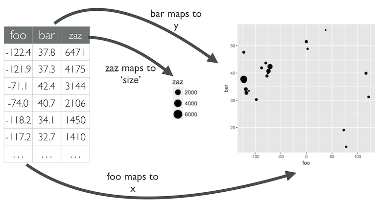

class: left top
background-image: url(imgs/hello.gif)
background-size: 100%

# Hola! <br/> Soy Joshua

```{r parameters, include=FALSE, warning=FALSE}
MAIN_COLOR <- "#47475C"
BCKGRN_COLOR <- "#FFFAFA" # snow white
# MAIN_FONT <- "Lato"
# MAIN_FONT <- "Alegreya Sans SC"
MAIN_FONT <- "IBM Plex Sans"

```

```{css, echo=FALSE, purl=FALSE}
@import url('https://fonts.cdnfonts.com/css/datalegreya');

.title-slide {
  background-image: url(imgs/title-slide-bg.png);
  background-size: cover;
}

.title-slide > h1,
.title-slide > h2,
.remark__tile-view__header {
  font-family: 'Datalegreya', sans-serif;
  font-weight: 400;
}

.title-slide > h1,
.remark__tile-view__header {
  font-size: 6em;
}

.title-slide > h1,
.title-slide > h2 {
  padding: 0px;
  margin: 0px;
}

body {
  font-family: -apple-system, BlinkMacSystemFont, "Segoe UI", Roboto, Helvetica, Arial, sans-serif, "Apple Color Emoji", "Segoe UI Emoji", "Segoe UI Symbol";
}

.highlight-last-item > ul > li, 
.highlight-last-item > ol > li {
  opacity: 0.5;
}
.highlight-last-item > ul > li:last-of-type,
.highlight-last-item > ol > li:last-of-type {
  opacity: 1;
}

```

```{r setup-xaringan, include=FALSE, warning=FALSE, purl=FALSE}
library(xaringanthemer)

style_mono_accent(
  base_color       = MAIN_COLOR,
  background_color = BCKGRN_COLOR,
  # header_font_google = google_font("Alegreya Sans SC", 100),
  header_font_google = google_font(MAIN_FONT, 100),
  text_font_google   = google_font("Roboto"),
  code_font_google   = google_font("Fira Mono"),
  base_font_size = "22px",
  header_h1_font_size = "2.0rem", # "2.75rem",
  header_h3_font_size = "1.5rem", # "2.75rem",
  outfile = here::here("202107-visualizacion-desde-el-analsis-de-datos/xaringan-themer.css")
)

xaringanExtra::use_scribble(pen_color = MAIN_COLOR) # press S
xaringanExtra::use_tile_view()                      # press O
xaringanExtra::use_webcam()                         # press W
xaringanExtra::use_animate_all("fade")
xaringanExtra::use_freezeframe() # for GIFs!
# xaringanExtra::use_progress_bar(color = "red", location = "bottom", height = "30px")
```

```{r setup, include=FALSE, warning=FALSE}
knitr::opts_chunk$set(
  message = FALSE,
  warning = FALSE,
  echo = FALSE,
  dev = "svg",
  cache = FALSE,
  fig.path = "imgs-r/knitr-img-",
  fig.align = "center",
  fig.width = 11,
  fig.height = 5
)

library(tidyverse)
library(kunstomverse)
library(patchwork)
library(ggforce)
library(showtext)

font_add_google(MAIN_FONT, "main_font")

showtext_auto()

theme_set(
  kunstomverse::theme_knst(
    base_size       = 10,
    axis_title_size = 8,
    base_family     = "main_font",
    plot_margin     = ggplot2::margin(10, 10, 10, 10),
    plot_title_face = "plain", 
    subtitle_face = "plain"
    ) +
    theme(
      plot.title = element_text(face = "plain"),
      plot.background = element_rect(fill = BCKGRN_COLOR, colour = NA),
      panel.background = element_rect(fill = BCKGRN_COLOR, colour = NA),
      legend.key.width = unit(1.5, "cm")
    )
  )

scale_fill_pres_c <- function(option = "C", begin = 0.05, end = 0.85, ...) {
  scale_fill_viridis_c(option = option, begin = begin, end = end, ...)
}

scale_fill_pres_d <- function(option = "C", begin = 0.05, end = 0.85, ...) {
  scale_fill_viridis_d(option = option, begin = begin, end = end, ...)
}

scale_color_pres_c <- function(option = "C", begin = 0.05, end = 0.85, ...) {
  scale_color_viridis_c(option = option, begin = begin, end = end, ...)
}
scale_color_pres_d <- function(option = "C", begin = 0.05, end = 0.85, ...) {
  scale_color_viridis_d(option = option, begin = begin, end = end, ...)
}
```

---

class: highlight-last-item

# Hola! <br/> Soy Joshua

--


- Soy estadístico.

--

- Me gusta programar (en R!).

--

- Escribo código para comer. Y como para escribir código.

--

- Mi __misión__ es motivarlos en los que veremos hoy!

---

class: left top
background-image: url(imgs/yay.gif)
background-size: 100%

# <span style="background-color:white;margin:5px">Yay!</span>

---

# Visualización en el análisis de datos

<br>
<br>


```{r out.width="80%"}
 knitr::include_graphics("imgs/data-science.svg")
```

---

# Visualización __de datos__

Herramienta que codifica información a través...

<br>

```{r out.width="60%", fig.align='center'}
knitr::include_graphics("imgs/data-viz.jpg")
```

---

# Visualización __de datos__

Cada atributo de un círculo -posición, tamaño- es representado por un valor de los datos.

<br>

```{r out.width="70%", fig.align='center'}

```

---

# Antes de seguir

Un poco de jerga:

--

- Una __variable__ es una cantidad, que puede ser medida: estatura, magnitud de un sismo, velocidad.

- Un __valor__ es un estado de la variable cuando se mide: 1.20 metros, 8° Richter.

- Una __observación__ o caso es un conjunto de mediciones -no de la misma variable necesariamente- pero si en un mismo instante y a un mismo objeto.

--

```{r out.width="70%", fig.align='center'}
knitr::include_graphics("imgs/tidy-1.png")
```

---

class: left middle
background-image: url(imgs/legobricks.jpg)
background-size: 100%

# <span style="background-color:white;margin:5px">Un primer ejemplo</span>

---

# Datos

```{r legodata, cache=TRUE}
legos <- read_csv("https://raw.githubusercontent.com/seankross/lego/master/data-tidy/legosets.csv") %>% 
  mutate(year2 = floor(Year/10)*10) %>% 
  sample_n(3000)
```

```{r out.width="90%", fig.align='center'}
# knitr::include_graphics(here::here("202107-visualizacion-desde-el-analsis-de-datos/imgs/data-viz.jpg"))
knitr::include_graphics("imgs/legoscsv.png")
```

---

# Explorar

¿Qué vemos?

```{r}
ggplot(legos) + 
  geom_point(aes(Pieces, USD_MSRP), alpha = 0.25, size = 1) +
  scale_y_sqrt(labels = scales::dollar, limits = c(1, 300)) +
  scale_x_sqrt(labels = scales::comma, limits = c(1, 2000)) +
  labs(title = "Precio segun piezas", x = "Piezas", y = "Precio USD")
```

---

# Intento inicial

Codificamos mayor información

```{r}
ggplot(legos) + 
  geom_point(aes(Pieces, USD_MSRP, size = Minifigures, color = year2), alpha = 0.5) +
  scale_y_sqrt(labels = scales::dollar, limits = c(1, 300)) +
  scale_x_sqrt(labels = scales::comma, limits = c(1, 2000)) +
  scale_size(name = "Piezas") +
  scale_color_pres_c(name = "", breaks = c(1970, 1980, 1990, 2000, 2010)) +
  labs(title = "Precio segun piezas", x = "Piezas", y = "Precio USD")
```

---

# Otro intento

Cada visualización cuenta una historia distinta...

```{r}
fmt_dec <- function(x) {
  
  if(as.numeric(x) == 2000) {
    out <- x
  } else {
    out <- paste(str_extract(x, "[0-9]{2}$"), "'s")
  }
  
  out
  
}

fmt_dec <- Vectorize(fmt_dec)

ggplot(legos) +
  geom_jitter(aes(factor(year2), USD_MSRP, size = Pieces, color = Year), alpha = 0.5, width = 0.25) +
  scale_color_pres_c(breaks = c(1970, 1990, 2010), guide = "none") + 
  scale_size(name = "Piezas") +
  scale_y_continuous(name = "Precio USD", labels = scales::dollar, limits = c(0, 300)) + 
  scale_x_discrete(name = "Década", labels = fmt_dec) +
  labs(title = "Precios por década")
```

---

class: right top
background-image: url(imgs/metro.jpg)
background-size: 100%

# <span style="color:white">Entendimiento de los datos <br/>con la visualización</span>


---

# Datos

Ingresos de usuarios a estaciones de metros cada media hora

```{r metrodata, cache=TRUE, include=FALSE}
data <- read_delim(url("https://tinyurl.com/data-metro-scl"), delim = ";")

data <- data %>% 
  filter(!str_detect(paraderosubida, "[0-9]+-[0-9]")) %>% 
  filter(paraderosubida != "-") %>% 
  filter(lubridate::hour(mediahora) > 0) 

data <- data %>% 
  mutate(mediahora = lubridate::as_datetime(mediahora))

year(data$mediahora) <- 2015

data <- data %>% 
  tidyr::expand(paraderosubida, mediahora) %>% 
  left_join(data, by = c("paraderosubida", "mediahora")) %>% 
  mutate(subidas_laboral_promedio = coalesce(subidas_laboral_promedio, 0))

data
```

```{r out.width="45%", fig.align='center'}
# knitr::include_graphics(here::here("202107-visualizacion-desde-el-analsis-de-datos/imgs/data-viz.jpg"))
knitr::include_graphics("imgs/metrocsv.png")
```

---

# Partamos por lo simple

Visualicemos los datos de una estación:

```{r}
dplazamaipu <- data %>% 
  filter(paraderosubida == "PLAZA MAIPU")

ggplot(dplazamaipu) +
  geom_point(aes(subidas_laboral_promedio, mediahora, color = paraderosubida), size = 1.5) +
  scale_y_datetime(date_labels = "%R") +
  scale_x_continuous(labels = comma) +
  scale_color_pres_d(guide = "none")
```

---

# ¿Simple?

Es bueno equivocarse (?).

```{r}
ggplot(dplazamaipu) +
  geom_path(aes(subidas_laboral_promedio, mediahora, color = paraderosubida), size = 1.5) +
  scale_y_datetime(date_labels = "%R") +
  scale_x_continuous(labels = comma) +
  scale_color_pres_d(guide = "none")
```

---

# Ahora sí!!

Hay ciertas convenciones que no es malo seguir...

```{r}
ggplot(dplazamaipu) +
  geom_path(aes(mediahora, subidas_laboral_promedio, color = paraderosubida), size = 1.5) +
  scale_x_datetime(date_labels = "%R") +
  scale_y_continuous(labels = comma) +
  scale_color_pres_d(name = NULL)
```

---

# Combinemos

Importante observar patrones/relaciones en los datos.

```{r}
d1 <- data %>% 
  filter(paraderosubida %in% c("PLAZA MAIPU", "LAGUNA SUR"))

c <- d1 %>% 
  spread(paraderosubida, subidas_laboral_promedio) %>%
  filter(complete.cases(.)) %>% 
  select(-1) %>%
  as.matrix() %>% 
  cor() %>% 
  as.vector() %>% 
  nth(2)

p1 <- ggplot(d1) +
  geom_line(
    aes(mediahora, subidas_laboral_promedio, color = paraderosubida, group = paraderosubida),
    size = 1.2
    ) +
  scale_x_datetime(date_labels = "%R") +
  scale_y_continuous(label = scales::comma) +
  scale_color_pres_d(name = NULL)

p1
```

---

# Correlación 

Es una _métrica_ de asociación lineal. Nos ayuda a _cuantificar_ la asociación.

--

```{r}
set.seed(123)

n <- 100
x <- rnorm(n)
e <- rnorm(n)

pc <- tibble(
  beta  = c(0,  1, 1, -1, -1, 0),
  beta2 = c(0,  0, 0,  1,  0, 1),
  sd    = c(1,  1, 0,  0,  1, 1),
) %>% 
  pmap_df(function(beta = 1, beta2 = 1, sd = 1){
    
    tibble(
      x = x,
      y = beta * x + beta2 * x^2 + sqrt(sd) * e,
      cor = cor(x, y)
    )
    
  }) %>% 
  mutate(
    cor = round(cor, 3),
    cor = str_glue("{cor} ({ percent(cor)})"),
    # cor = percent(cor, accuracy = 0.01),
    cor = fct_inorder(as.character(cor))
    ) %>% 
  ggplot(aes(x, y)) +
  geom_point(alpha = 0.25) +
  facet_wrap(vars(cor), scales = "free") +
  theme(
    axis.text.x = element_text(size = 8),
    axis.text.y = element_text(size = 8),
    )

pc
```

---

# Correlación 

Un valor calculado con dos valores numéricos. Va de -1 a 1.


```{r}
pc +
  geom_smooth(method = "lm", color = "darkred", size = 2, formula = y ~  x)
```

---

# Entonces...

```{r}
df <- d1 %>% 
  spread(paraderosubida, subidas_laboral_promedio) 

lab_dates <- df %>% 
  pull(mediahora) %>% 
  pretty(6)

lab_dates_lbls <- str_extract(lab_dates, "[0-9]{2}:[0-9]{2}")

p2 <- d1 %>% 
  spread(paraderosubida, subidas_laboral_promedio) %>%  
  ggplot(aes(`LAGUNA SUR`, `PLAZA MAIPU`)) +
  kunstomverse::geom_point2(aes(fill = as.numeric(mediahora)), size = 3) +
  scale_y_continuous(label = scales::comma) +
  scale_x_continuous(label = scales::comma) +
  scale_fill_pres_c(name = NULL, breaks = as.numeric(lab_dates), labels = lab_dates_lbls) +
  labs(subtitle = str_glue("Correlación { percent(c, , accuracy = 0.01) }"))

p1 | p2 
```

---

# Otro par de estaciones

```{r}
d1 <- data %>% 
  filter(paraderosubida %in% c("UNIVERSIDAD DE CHILE", "PLAZA DE PUENTE ALTO")) 

c <- d1 %>% 
  spread(paraderosubida, subidas_laboral_promedio) %>%
  filter(complete.cases(.)) %>% 
  select(-1) %>%
  as.matrix() %>% 
  cor() %>% 
  as.vector() %>% 
  nth(2)

p1 <- ggplot(d1) +
  geom_line(
    aes(mediahora, subidas_laboral_promedio, color = paraderosubida, group = paraderosubida),
    size = 1.2
    ) +
  scale_x_datetime(date_labels = "%R") +
  scale_y_continuous(label = scales::comma) +
  scale_color_pres_d(name = NULL)

p2 <-  d1 %>% 
  spread(paraderosubida, subidas_laboral_promedio) %>%  
  ggplot(aes(`UNIVERSIDAD DE CHILE`, `PLAZA DE PUENTE ALTO`)) +
  kunstomverse::geom_point2(aes(fill = as.numeric(mediahora)), size = 3) +
  scale_y_continuous(label = scales::comma) +
  scale_x_continuous(label = scales::comma) +
  scale_fill_pres_c(name = NULL, breaks = as.numeric(lab_dates), labels = lab_dates_lbls) +
  labs(subtitle = str_glue("Correlación { percent(c, , accuracy = 0.01) }"))

p1 | p2 
```

---

# Correlaciones

```{r}
dcor <- data %>%
  widyr::pairwise_cor(
    paraderosubida,
    mediahora,
    subidas_laboral_promedio
    )

ncors <- dcor %>% 
  nrow() %>% 
  comma()

nest <- dcor %>% 
  count(item1) %>% 
  nrow() %>% 
  comma()
```

Calculamos con `r nest` estaciones `r ncors` correlaciones. Visualización vía __heatmap__.

--

```{r}
ggplot(dcor) +
  geom_tile(aes(item1, item2, fill = correlation)) + 
  scale_fill_pres_c(limits = c(-1, 1), breaks = seq(-1, 1, length.out = 5), labels = percent) +
  theme(
    axis.text.y = element_text(size = 3),
    axis.text.x = element_text(size = 3, angle = 90, hjust = 1),
    legend.position = "right",
    legend.key.width = unit(0.5, "cm")
    ) +
  labs(x = NULL, y = NULL)
```


---

# Correlaciones

El orden, en este caso, importa.

```{r}
M <- data %>% 
  spread(paraderosubida, subidas_laboral_promedio) %>% 
  select(-1) %>% 
  mutate_all(replace_na, 0) %>% 
  cor()

order <- corrplot::corrMatOrder(M, order = "hclust")
M <- M[order, order]

lvls <- colnames(M)

dcor <- dcor %>% 
  mutate_if(is.character, factor, levels = lvls)

pcors <- ggplot(dcor) +
  geom_tile(aes(item1, item2, fill = correlation)) + 
  scale_fill_pres_c(limits = c(-1, 1), breaks = seq(-1, 1, length.out = 5), labels = percent) +
  theme(
    axis.text.y = element_text(size = 3),
    axis.text.x = element_text(size = 3, angle = 90, hjust = 1),
    legend.position = "right",
    legend.key.width = unit(0.5, "cm")
    ) +
  labs(x = NULL, y = NULL)

pcors
```

---

# Redes y comunidades

```{r}
library(igraph)
library(ggnetwork)

ncors <- 250

dcorf <- dcor %>%
  filter(as.character(item1) < as.character(item2)) %>% 
  arrange(desc(correlation)) %>% 
  mutate(w = correlation*correlation) %>% 
  head(ncors)
```


Considerando las `r ncors` correlaciones más altas realizamos una red donde el peso
del vértice es la correlación y el tamaño es la cantidad de subidas.


```{r}
g <- graph_from_data_frame(dcorf, directed = FALSE)

E(g)$weight <- dcorf$w

wc <- cluster_fast_greedy(g)
nc <- length(unique(membership(wc)))

dvert <- tibble(paraderosubida = V(g)$name) %>% 
  mutate(comm = membership(wc)) %>% 
  left_join(
    data %>%
      group_by(paraderosubida) %>%
      summarise(n = sum(subidas_laboral_promedio)),
    by = "paraderosubida"
    ) %>% 
  left_join(
    data %>%
      group_by(paraderosubida) %>% 
      summarise(tend = cor(seq(1, n()), subidas_laboral_promedio)),
    by = "paraderosubida"
    ) %>% 
  ungroup()

# dvert

V(g)$label <- dvert$paraderosubida
V(g)$size <- dvert$n
V(g)$subidas_totales_miles <- round(dvert$n/1000, 2)
V(g)$comm <- membership(wc)
V(g)$tendencia <- round(dvert$tend, 2)
V(g)$color <- dvert$comm

set.seed(123)

dfnet <- ggnetwork(g)

dfnet2 <- dfnet %>%
  as.matrix() %>%
  as.data.frame() %>%
  tbl_df() %>%
  select(x, y, name, weight, size, color) %>%
  mutate_all(as.character) %>%
  mutate_at(vars(x, y, weight, size), as.numeric) %>%
  filter(is.na(weight))

pnet <- ggplot(dfnet) + 
  geom_edges(
    aes(-x, -y, size = width, color = factor(comm), xend = -xend, yend = -yend), 
    color = "gray50", size = 1, alpha = 0.25
    ) +
  geom_point(
    aes(-x, -y, size = size, color = factor(comm), fill = factor(comm)), shape = 21
    ) +
  ggrepel::geom_text_repel(
    aes(-x, -y, label = name), size = 2,
    data = dfnet2, color = "#666666",
    force = 10,
    family = "main_font"
    ) +
  scale_fill_pres_d(name = "Comunidad") + 
  # scale_color_pres_d() + 
  scale_size(guide = "none") +
  theme(
    panel.grid.major = element_blank(),
    axis.text.x = element_blank(),
    axis.text.y = element_blank(),
    legend.position = "right"
  ) +
  
  guides(
    color = guide_legend(override.aes = list(size = 5)),
    fill = guide_legend(override.aes = list(size = 5))
    ) +
  
  labs(
    x = NULL,
    y = NULL,
    size = "Subidas",
    color = "Comunidad"
    )

pnet
```

---

# Reducción de Dimensionalidad

Hasta ahora hemos usado solamente *correlaciones* que miden asociacion lineal 
y no es un indicador necesariamente robusto para usarlo como métrica de distancia.

--

Usaremos todos los datos por estacion y usaremos __UMAP__, un algoritmo 
para _resumir_ toda la información en *2* columnas/variables.

--

Lleva de una tabla con muchas columnas por observación a 2 columnas:

<small><small><small><small><small><small>

.pull-left[
```{r}
nhead <- 8

datas <- data %>% 
  mutate(mediahora = format(mediahora, "%R")) %>% 
  spread(mediahora, subidas_laboral_promedio)

datas <- datas %>% 
  mutate_if(is.numeric, replace_na, 0)

datas %>% 
  select(1:8) %>% 
  head(nhead) %>% 
  knitr::kable(format = "html")
```
] 

.pull-right[
```{r, cache=TRUE}
library(uwot)

set.seed(123)

um <- umap(datas, verbose = TRUE, n_threads = 3, n_neighbors = 20)

dumap <- as.data.frame(um) %>% 
  tbl_df() %>% 
  mutate(paraderosubida = pull(datas, paraderosubida)) %>% 
  select(paraderosubida, everything())

dumap %>% 
  head(nhead) %>% 
  knitr::kable(format = "html")
```
]

</small></small></small></small></small></small>

---

# Reducción de Dimensionalidad

De esta forma:

```{r}
set.seed(1234)

pumap <- ggplot(dumap) +
  geom_point(aes(V1, V2), alpha = 0.3) +
  ggrepel::geom_text_repel(
    aes(V1, V2, label = paraderosubida),
    data = . %>% sample_n(30),
    size = 3,
    force = 10
    ) +
  xlim(c(-4, 3)) + ylim(c(-3, 5))

pumap
```

---

# Clustering 

De vez en cuando es relevante agrupar información/perfilar. __Diagramas de Voronoi__.

```{r}
withins <- map_dbl(1:15, function(k = 4){

  km <- kmeans(
    dumap %>% select(-paraderosubida), 
    centers = k,
    nstart = 50,
    iter.max = 150
    )
  
  km$tot.withinss
    
}) 

# plot(withins)

km <- kmeans(
  dumap %>% select(-paraderosubida), 
  centers = 4,
  nstart = 50,
  iter.max = 150
  )

dumap <- dumap %>% 
  mutate(cluster = as.character(km$cluster))

dcenters <- km$centers %>% 
  as.data.frame() %>% 
  as_tibble() %>% 
  mutate(cluster = as.character(row_number()))

set.seed(1234)

# xmin, xmax, ymin, ymax.
bnd <- c(-4, 3, -3, 5)

pumapkm <- ggplot(dumap, aes(V1, V2, fill = cluster, group = -1)) +
  
  geom_voronoi_tile(data = dcenters, alpha = 0.2, bound = bnd) +
  geom_voronoi_segment(data = dcenters, color = "gray70", bound = bnd) +
  
  geom_point(aes(V1, V2, fill = cluster), alpha = 0.3) +
  # kunstomverse::geom_point2(aes(V1, V2, fill = cluster), alpha = 0.6, size = 5) +
  
  ggrepel::geom_text_repel(
    aes(V1, V2, label = paraderosubida),
    data = . %>% sample_n(30),
    size = 3,
    force = 10
    ) +
  
  scale_fill_pres_d() +
  
  xlim(c(-4, 3)) + ylim(c(-3, 5)) +
  
  theme(legend.position = "none")

pumapkm
```

---

# ¿Por qué 4 grupos?

El algoritmo para encontrar grupos usado fue __K-means__. Uno usualmente
da el número de grupos y determina que observación queda en que grupo.

--

Una regla para decidir el número de cluster es realizando el proceso
varias veces con distintas cantidad de centros.

```{r, fig.height=4}
dkm <- tibble(
  tot.withinss = withins,
  cluster      = seq(length(withins))
) 

pkm <- ggplot(dkm, aes(cluster, tot.withinss, fill = "1", color = "1")) +
  
  geom_line(size = 2) +
  kunstomverse::geom_point2(size = 3) +
  
  scale_x_continuous(breaks = dkm$cluster) +
  labs(
    y = "Suma de los cuadrados dentro de cada grupo",
    x = "Grupos"
  ) +
  scale_fill_pres_d() +
  scale_color_pres_d() +
  theme(legend.position = "none")

pkm
```

---

# Clustering (ver. 2)

__Dendograma__ visualiza la forma de agrupación a medida que aumento distancia.

```{r}
library(ggdendro)

dhclust <- dumap %>% 
  column_to_rownames("paraderosubida") %>% 
  select(V1, V2)

hc       <- hclust(dist(dhclust), "ave")           # heirarchal clustering
dendr    <- dendro_data(hc, type="rectangle")    # convert for ggplot
clust    <- cutree(hc, k = 4)                    # find 4 clusters
clust.df <- data.frame(label = names(clust), cluster = factor(clust))
dendr[["labels"]] <- merge(dendr[["labels"]], clust.df, by = "label")

pdend <- ggplot() +
  geom_segment(
    data = segment(dendr),
    aes(x = x, y = y, xend = xend, yend = yend)
    ) +
  geom_text(
    data = label(dendr),
    aes(x, y, label = label, hjust = 1, color = cluster),
    size = 1.8
    
  ) +
  coord_flip() +
  scale_color_pres_d() +
  # scale_y_continuous(limits = c(-0.10, NA)) +
  # scale_y_reverse(expand=c(0.2, 0)) +
  theme(
    axis.line.y = element_blank(),
    axis.ticks.y = element_blank(),
    axis.text.y = element_blank(),
    axis.title.y = element_blank(),
    panel.grid.major.y = element_blank(),
    panel.grid = element_blank(),
    legend.position = "right"
  ) +
  guides(color = guide_legend(override.aes = list(size = 5))) 

pdend
```

---

# Clustering (ver. 3)

Otra visualización con los mismos datos del dendograma. __Árbol filogenético__.

```{r, include=FALSE}
library(ape)

plot(
  ape::as.phylo(hc), 
  type = "unrooted",
  edge.width = 2, 
  edge.lty = 2,
  # tip.color = colors[clust],
  no.margin = TRUE,
  label.offset = 0.5,
  plot = FALSE
  )

L <- get("last_plot.phylo", envir = .PlotPhyloEnv)

dedges <- tibble(x = L$xx, y = L$yy) %>% 
  mutate(id = row_number())

dedges2 <- as.data.frame(L$edge) %>% 
  as_tibble() %>% 
  left_join(dedges, by = c("V1" = "id")) %>% 
  left_join(dedges, by = c("V2" = "id"),  suffix = c("", "_end")) 

dnodes <- dedges %>% 
  head(length(clust)) %>% 
  mutate(
    paraderosubida = names(clust),
    cluster = as.character(clust)
    )
```


```{r}
pphylo <- ggplot(dedges2) +
  geom_segment(aes(x = x, y = y, xend = x_end, yend = y_end, group = -1L), color = "gray55") +
  kunstomverse::geom_point2(aes(x, y, fill = cluster), data = dnodes, size = 4) +
  scale_color_pres_d()  + 
  scale_fill_pres_d()  + 
  theme(
    panel.grid.major = element_blank(),
    axis.text.x = element_blank(),
    axis.text.y = element_blank(),
    legend.position = "right"
  ) +
  labs(x = NULL, y = NULL) +
  scale_y_continuous(expand = expansion(mult = 0.25)) +
  scale_x_continuous(expand = expansion(mult = 0.25)) 

pphylo
```

---

# Clustering (ver. 3)

No sirve de mucho si las etiquetas.

```{r}
pphylo2 <- ggplot(dedges2) +
  geom_segment(
    aes(x = x, y = y, xend = x_end, yend = y_end, group = -1L), 
    color = "gray70", 
    size = .9
    ) +
  
   ggrepel::geom_text_repel(
    aes(x, y, label = paraderosubida),
    data = dnodes,
    size = 1.5,
    max.overlaps = 1000,
    segment.colour = "gray80"
    )  +
  
  kunstomverse::geom_point2(aes(x, y, fill = cluster), data = dnodes, size = 4) +
  scale_color_pres_d(begin = 0.1, end = .8)  + 
  scale_fill_pres_d(begin = 0.1, end = .8)  + 
  theme(
    panel.grid.major = element_blank(),
    axis.text.x = element_blank(),
    axis.text.y = element_blank(),
    legend.position = "right"
  ) +
  labs(x = NULL, y = NULL) +
  scale_y_continuous(expand = expansion(mult = 0.25)) +
  scale_x_continuous(expand = expansion(mult = 0.25)) 
 
pphylo2
```


---

# Entonces, ¿significan algo los cluster generados?

--

Revisamos _nuestro primer gráfico_ para cada estación y separados por grupo.

```{r, fig.width = 13}
dataf <- data %>% 
  left_join(dumap %>% select(paraderosubida, cluster), by = "paraderosubida")

pfin <- ggplot(dataf, aes(mediahora, subidas_laboral_promedio)) +
  geom_line(aes(group = paraderosubida), alpha = 0.1, size = 0.8) +
  geom_smooth(
    aes(color = cluster),
    se = FALSE, size = 2,
    method = 'gam',
    formula = y ~ s(x, bs = "cs")
    ) + 
  scale_color_pres_d() +
  facet_wrap(vars(cluster), ncol = 4) +
  scale_x_datetime(date_labels = "%R") +
  scale_y_continuous(labels = comma)

pfin
```


---

# Contextualizar

```{r}
routes <- read_csv(here::here("202107-visualizacion-desde-el-analsis-de-datos/data/routes.txt"))
trips  <- read_csv(here::here("202107-visualizacion-desde-el-analsis-de-datos/data/trips.txt"))
stops  <- read_csv(
  here::here("202107-visualizacion-desde-el-analsis-de-datos/data/stops.txt"),
  col_types = cols(stop_url = col_character())
  )
shapes <-read_csv(here::here("202107-visualizacion-desde-el-analsis-de-datos/data/shapes.txt"))

stops_metro <- stops %>%
  filter(!grepl("\\d", stop_id)) %>% 
  mutate(stop_url = basename(stop_url))

routes_metro <- routes %>% 
  filter(grepl("^L\\d",route_id))

shapes_metro <- routes %>% 
  filter(grepl("^L\\d",route_id)) %>% 
  semi_join(trips, .,  by = "route_id") %>% 
  semi_join(shapes, ., by = "shape_id") %>% 
  ### IMPORTANTE
  filter(str_detect(shape_id, "-I")) %>% 
  mutate(shape_id2 = str_replace(shape_id, "-I", ""))

colors_metro <- distinct(shapes, shape_id) %>% 
  left_join(distinct(trips, shape_id, route_id), by = "shape_id") %>% 
  left_join(distinct(routes, route_id, route_color), by = "route_id") %>% 
  semi_join(shapes_metro, by = "shape_id") %>% 
  mutate(route_color = paste0("#", route_color))
  
str_to_id2 <- function(x) {
   x %>%
    as.character() %>%
    str_trim() %>%
    str_to_lower() %>% 
    str_replace_all("\\\\s+", "_") %>%
    str_replace_all("\\\\\\\\|/", "_") %>%
    str_replace_all("\\\\[|\\\\]", "_") %>%
    str_replace_all("_+", "_") %>%
    str_replace_all("_$|^_", "") %>% 
    str_replace_all("á", "a") %>%
    str_replace_all("é", "e") %>% 
    str_replace_all("í", "i") %>% 
    str_replace_all("ó", "o") %>% 
    str_replace_all("ú", "u") %>% 
    str_replace_all("ñ", "n") %>% 
    str_replace_all("`", "") %>% 
    str_replace_all("_de_", "_")
}

dumap <- mutate(dumap, id = str_to_id2(paraderosubida))

data4 <- dataf %>% 
  group_by(paraderosubida, cluster) %>% 
  summarise(median = median(subidas_laboral_promedio), .groups = "drop") %>% 
  ungroup() %>% 
  mutate(id = str_to_id2(paraderosubida))

stops_metro_data <- stops_metro %>% 
  mutate(id = str_to_id2(stop_name)) %>% 
  left_join(data4, by = "id") %>% 
  filter(!is.na(cluster))

rm(shapes, routes, stops, trips, data4)

colors_metro_manual <- colors_metro %>% 
  select(name = route_id, value = route_color) %>% 
  deframe()


pmetro <- ggplot() +
  
  geom_path(data = shapes_metro, aes(shape_pt_lon, shape_pt_lat, color = shape_id2), size = 2) +
  scale_color_manual(name = "Línea", values = colors_metro_manual) +
  
  scale_size(guide = "none") +
  
  kunstomverse::geom_point2(data = stops_metro_data, aes(stop_lon, stop_lat, size = log(median), fill = cluster)) + 
  scale_fill_pres_d(name = "Clúster") +
  
  facet_wrap(vars(cluster)) +
  coord_equal() +
  
  guides(
    color = guide_legend(override.aes = list(size = 5)),
    fill = guide_legend(override.aes = list(size = 5))
    ) + 
  
  theme(
    panel.grid.major = element_blank(),
    axis.text.x = element_blank(),
    axis.text.y = element_blank(),
    legend.position = "right"
    ) 

pmetro
```


---

# Contextualizar (ver. 2)

```{r}
library(OpenStreetMap)

delta <- 0.005

box <- shapes_metro %>% 
  summarise(
    min(shape_pt_lat) - delta,
    max(shape_pt_lat) + delta,
    min(shape_pt_lon) - delta,
    max(shape_pt_lon) + delta,
  ) %>% 
  gather() %>% 
  pull()

LAT1 = box[1]
LAT2 = box[2]
LON1 = box[3]
LON2 = box[4]

map <- openmap(
  c(LAT2,LON1), c(LAT1,LON2), zoom = NULL,
  type = c("osm", "stamen-toner", "stamen-terrain","stamen-watercolor", "esri","esri-topo")[6],
  mergeTiles = TRUE
  )

map.latlon <- openproj(map, projection = "+proj=longlat +ellps=WGS84 +datum=WGS84 +no_defs")

ggmap <- autoplot(map.latlon) +
  
  geom_path(data = shapes_metro, aes(shape_pt_lon, shape_pt_lat, color = shape_id2), size = 2) +
  scale_color_manual(name = "Línea", values = colors_metro_manual) +
  
  scale_size(guide = "none") +
  
  kunstomverse::geom_point2(
    data = stops_metro_data, 
    aes(stop_lon, stop_lat, size = log(median), fill = cluster)
    ) + 
  
  scale_fill_pres_d(name = "Clúster") +
  
  guides(
    color = guide_legend(override.aes = list(size = 5)),
    fill = guide_legend(override.aes = list(size = 5))
    ) +
  
  labs(x = NULL, y = NULL) +
  
  theme(
    panel.grid.major = element_blank(),
    axis.text.x = element_blank(),
    axis.text.y = element_blank(),
    legend.position = "right"
  ) 
  
ggmap
```


---

```{r, fig.width = 15, fig.height=9}
# https://stackoverflow.com/a/46221054/829971
remove_geom <- function(ggplot2_object, geom_type) {
  # Delete layers that match the requested type.
  layers <- lapply(ggplot2_object$layers, function(x) {
    if (class(x$geom)[1] == geom_type) {
      NULL
    } else {
      x
    }
  })
  # Delete the unwanted layers.
  layers <- layers[!sapply(layers, is.null)]
  ggplot2_object$layers <- layers
  ggplot2_object
}

list(p1, p2, pcors, pnet, pumapkm, pkm, pdend, pphylo, pfin, pmetro, ggmap) %>%
  map(function(p){
    
    pb <- ggplot_build(p)
    nfacets <- pb$layout$layout$PANEL %>% length() 
    
    p <- remove_geom(p, "GeomTextRepel") + 
       theme(
         panel.grid.major = element_blank(),
         axis.text.x = element_blank(),
         axis.text.y = element_blank(),
         legend.position = "none",
         strip.text = element_blank(),
         panel.spacing = unit(0.1, "lines")
         
         ) +
      labs(x = NULL, y = NULL, title = NULL, subtitle = NULL) +
      coord_cartesian() 
      
    
    if(nfacets != 1){
      p <- p + 
        # ggforce::facet_grid_paginate(vars(cluster),  ncol = 1, nrow = 1, page = 1)
        facet_wrap(vars(cluster), ncol = 2, scales = "free")
    }
    
    p
    
  }) %>% 
  reduce(`+`)


knitr::purl(
  here::here("202107-visualizacion-desde-el-analsis-de-datos/index.Rmd"),
  here::here("202107-visualizacion-desde-el-analsis-de-datos/index.R"),
  documentation = 0L
  )
```

---

# Resumiendo

La __visualización de datos__:

<br/>

--

- Lleva información, es un mensaje.

- Ejercicio mental para decodificar información.

- Herramienta exploratoria.

- Distintas visualizaciones en mismos datos es una distinta historia.


---

# Gracias! 

Conversemos!

<br/>

--

- Más ideas en http://jkunst.com/blog

- Presentación: http://jkunst.com/slides/202107-visualizacion-desde-el-analsis-de-datos/index.html

- Código para hacer _toooodos_ los gráficos y análisis: http://jkunst.com/slides/202107-visualizacion-desde-el-analsis-de-datos/index.R


